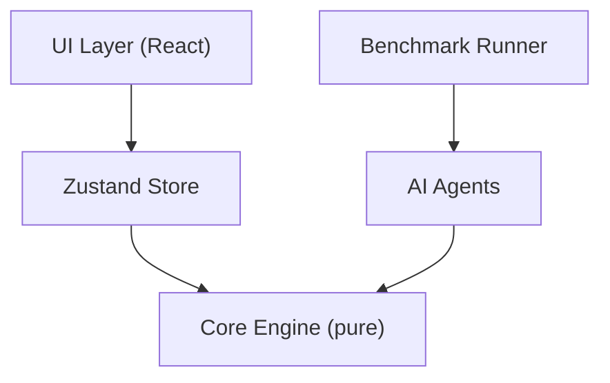
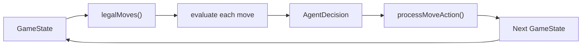

# Merge Catalyst — AI Agent Guide

## Agent Interface

All agents implement the `Agent` interface from `src/ai/types.ts`:

```ts
interface Agent {
  readonly name:   string;
  readonly config: Record<string, unknown>;

  nextAction(state: GameState): AgentAction;
  explain?(state: GameState): AgentEvaluation;
}
```

`nextAction` is the only required method. It receives the current `GameState` and returns a `Direction` (`'up' | 'down' | 'left' | 'right'`).

`explain` is optional — it returns the top candidate moves with scores and a reasoning string. Useful for debugging and documentation.

---

## Supporting Types

```ts
type AgentAction = 'up' | 'down' | 'left' | 'right';

interface CandidateMove {
  action:      AgentAction;
  score:       number;
  description?: string;
}

interface AgentDecision {
  action:       AgentAction;
  candidates?:  CandidateMove[];
  explanation?: string;
}

interface AgentEvaluation {
  topCandidates: CandidateMove[];
  chosen:        AgentAction;
  reasoning:     string;
}
```

---

## Implemented Agents

### RandomAgent (`src/ai/agents/randomAgent.ts`)

```ts
new RandomAgent(seed?)
```

Picks a uniform random legal move. Uses the seeded PRNG so runs are deterministic.

**Use as**: lower-bound baseline.

---

### GreedyAgent (`src/ai/agents/greedyAgent.ts`)

```ts
new GreedyAgent()
```

Evaluates all legal moves with `scoreImmediateMove()` and picks the best.

Immediate score = `outputGained × 5 + emptyCells × 20 + maxTileGrowth × 10 + cornerBonus × 2`

**Use as**: fast single-depth baseline.

---

### HeuristicAgent (`src/ai/agents/heuristicAgent.ts`)

```ts
new HeuristicAgent({ weights?: Partial<EvalWeights> })
```

Evaluates resulting state after each move using a weighted multi-factor function:

| Factor | Default Weight | Description |
|--------|---------------|-------------|
| `empty` | 270 | Empty cells after move |
| `monotonicity` | 47 | How sorted the grid is |
| `smoothness` | 100 | Penalise large adjacent differences |
| `corner` | 30 | Max tile in corner bonus |
| `merge` | 700 | Adjacent equal-value pairs |
| `maxTile` | 1 | Log2 of max tile |
| `anomaly` | -200 | Anomaly risk penalty |
| `output` | 10 | Current phase output |

Weights are configurable at construction time.

---

### BeamSearchAgent (`src/ai/agents/beamSearchAgent.ts`)

```ts
new BeamSearchAgent({ depth?: number, beamWidth?: number, weights?: Partial<EvalWeights> })
```

Performs beam search to `depth` levels, keeping top-`beamWidth` states at each level.
Returns the first move from the best final state.

Default: `depth=3, beamWidth=3`.

---

### MCTSAgent (`src/ai/agents/mctsAgent.ts`)

```ts
new MCTSAgent({ rollouts?: number, rolloutDepth?: number, seed?: number })
```

For each legal move, performs `rollouts` random simulations to depth `rolloutDepth`.
Returns the action with the highest mean evaluation score.

Default: `rollouts=20, rolloutDepth=10`.

---

## Policy Helpers

### `src/ai/policy/features.ts`

| Function | Returns | Description |
|----------|---------|-------------|
| `countEmptyCells(grid)` | number | Empty cell count |
| `maxTile(grid)` | number | Highest tile value |
| `monotonicity(grid)` | number | Grid monotonicity score |
| `smoothness(grid)` | number | Penalises adjacent differences |
| `cornerStability(grid)` | number | log2(maxTile) if in corner |
| `mergePotential(grid)` | number | Adjacent equal-tile pairs |
| `anomalyRisk(state)` | 0–1 | Risk factor based on active anomaly |
| `catalystSynergyBonus(state, ...)` | number | Bonus for catalyst-aligned moves |

### `src/ai/policy/evaluation.ts`

`evaluateState(state, weights?)` — single-function weighted evaluation of a `GameState`.

### `src/ai/policy/scoring.ts`

`scoreImmediateMove(state, dir)` — immediate score for a single move direction.  
`legalMoves(state)` — returns all directions that change the grid.

---

## Future RL Integration Plan

The `Agent` interface is already RL-ready. The `PolicyAgent` adapter in `src/ai/types.ts` wraps any `Policy` as an agent:

```ts
class PolicyAgent implements Agent {
  constructor(private policy: Policy) {}
  nextAction(state: GameState): AgentAction {
    return this.policy.selectAction(state);
  }
}
```

### Interfaces for future training

```ts
interface DQNPolicy extends Policy {
  readonly kind: 'dqn';
  loadWeights(checkpoint: unknown): void;
}

interface PPOPolicy extends Policy {
  readonly kind: 'ppo';
  loadWeights(checkpoint: unknown): void;
}
```

### Roadmap

1. **Observation space**: encode `GameState` as a flat vector (grid log2 values, phase index, steps/target ratio, catalyst flags, anomaly phase flag)
2. **Action space**: 4 discrete actions (up/down/left/right)
3. **Reward**: `finalOutput` at episode end (or per-move delta)
4. **Replay buffer**: `src/ai/policy/replayBuffer.ts` (to be created)
5. **Training loop**: `src/scripts/trainDQN.ts` (to be created)
6. **Evaluation**: run trained policy through `npm run benchmark` using `PolicyAgent`

### Replay / Export Ideas

- Export `reactionLog` from runs as a JSON training dataset
- Use `RunMetrics` as episode metadata
- Filter by "won" runs for imitation learning

The benchmark runner already produces `runs.csv` which can serve as an early supervised learning corpus.

---

## Diagrams

### Architecture



### Agent Evaluation Pipeline


