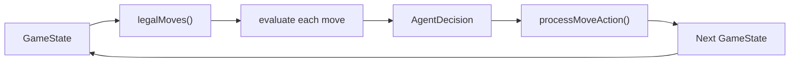
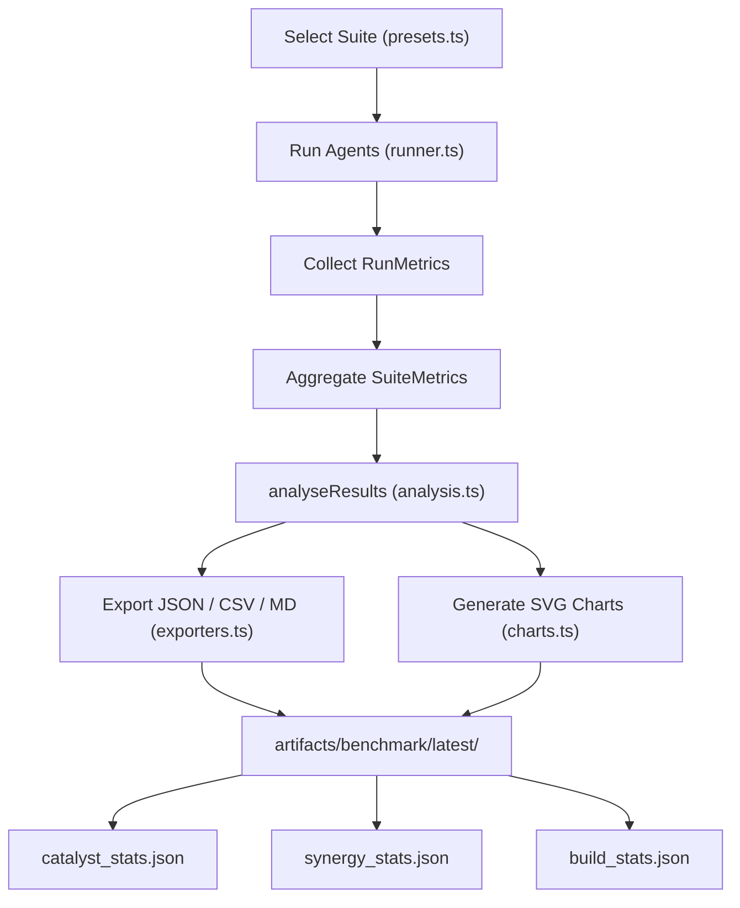
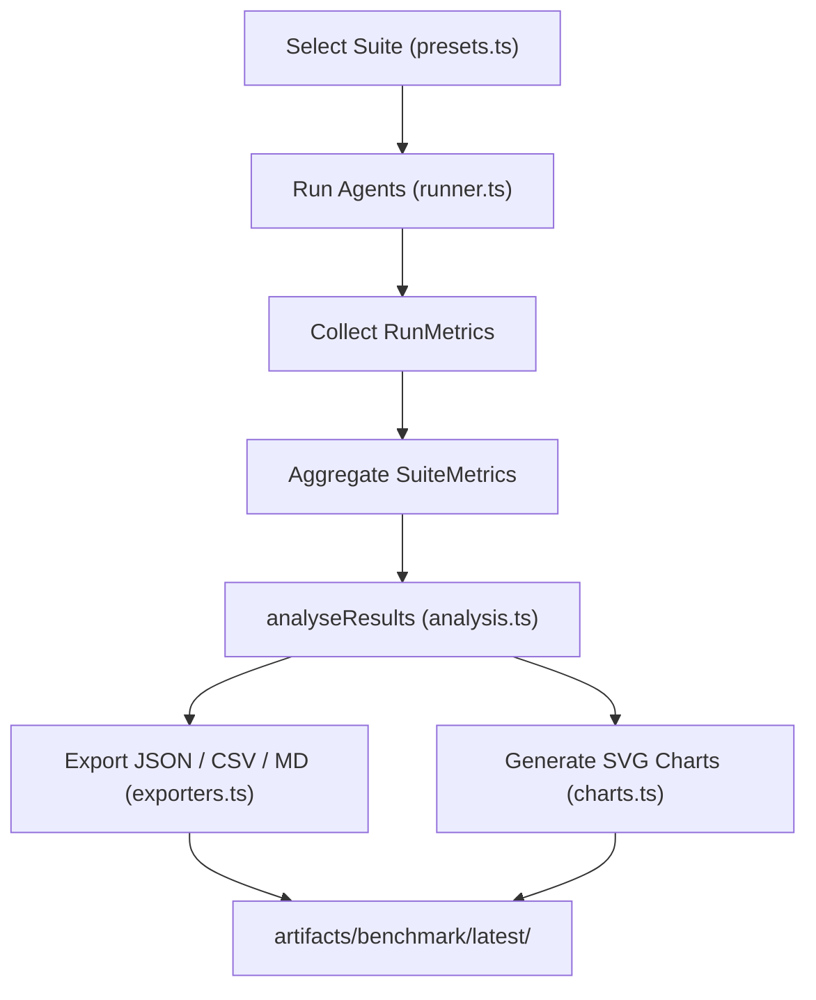
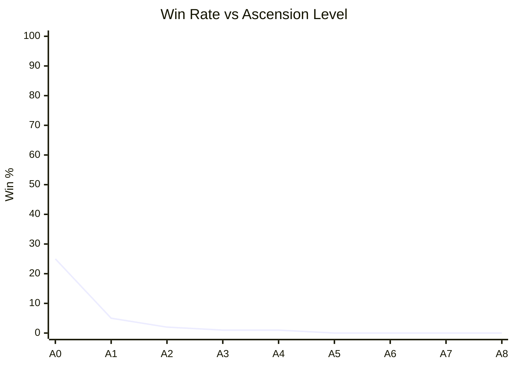

# Merge Catalyst — Benchmark Guide

## Goals

The benchmark framework lets you:
- Measure how well each AI agent plays the game
- Identify which phases are too hard or too easy
- Detect overpowered or underpowered Catalysts
- Detect overpowered Synergy combinations
- Measure Protocol impact on outcomes
- Measure Momentum average and max per run
- Produce reproducible, comparable numbers across code changes

---

## Agent Overview

| Agent | Strategy | Notes |
|-------|----------|-------|
| RandomAgent | Uniform random from legal moves | Baseline lower bound |
| GreedyAgent | Best immediate heuristic (output, empty, corner) | Fast, no lookahead |
| HeuristicAgent | Weighted multi-factor evaluation (empty/mono/smooth/corner/merge/anomaly) | Configurable weights |
| BeamSearchAgent | Beam search, configurable depth and width | Lookahead without full tree |
| MCTSAgent | Monte Carlo Tree Search with random rollouts | Best-effort quality |

All agents implement the `Agent` interface from `src/ai/types.ts`.

---

## Agent Evaluation Pipeline



---

## Metrics Explained

### Per-Run Metrics (`RunMetrics`)

| Metric | Description |
|--------|-------------|
| `finalOutput` | Total Output accumulated across all phases |
| `phasesCleared` | How many phases were completed |
| `won` | Whether Phase 6 was completed |
| `maxTile` | Highest tile value reached |
| `totalSteps` | Total valid moves made |
| `totalCatalysts` | How many catalysts were held at the end |
| `catalystReplacements` | How many times a catalyst was replaced |
| `totalEnergyEarned` | Proxy for energy economy |
| `avgOutputPerMove` | finalOutput / totalSteps |
| `anomalySurvivalRate` | Fraction of anomaly phases survived (0–1) |
| `avgMergesPerMove` | Average merges per step |
| `avgEmptyCells` | Average empty cells across all steps |
| `moveDiversity` | Normalised entropy of action distribution (0=one direction, 1=uniform) |

### Aggregate Suite Metrics (`SuiteMetrics`)

| Metric | Description |
|--------|-------------|
| `meanOutput` | Mean `finalOutput` across all runs |
| `medianOutput` | Median `finalOutput` |
| `p90Output` | 90th-percentile `finalOutput` |
| `winRate` | Fraction of runs that completed Phase 6 |
| `maxTileDistribution` | Histogram of max tile values |
| `phaseClearDist` | Histogram of phases cleared |
| `avgStepsSurvived` | Mean total steps |
| `avgOutputPerMove` | Mean output efficiency |
| `avgCatalystCount` | Mean catalysts held |
| `anomalySuccessRate` | Mean anomaly survival rate |
| `scoreVariance` | Variance of `finalOutput` |
| `scoreStdDev` | Standard deviation |

---

## Build Analysis (New in v3)

### Catalyst Metrics (`catalyst_stats.json`)

| Field | Description |
|-------|-------------|
| `pickRate` | Fraction of runs where this catalyst was held at end |
| `winRate` | Win rate of runs that held this catalyst |
| `meanOutput` | Average final output when catalyst was held |
| `avgOutputContribution` | Average output-per-move when catalyst was held |

### Synergy Metrics (`synergy_stats.json`)

| Field | Description |
|-------|-------------|
| `triggerRate` | Fraction of runs that had both synergy catalysts active |
| `winRate` | Win rate when this synergy was active |
| `meanOutput` | Average final output when synergy was active |

### Build Metrics (`build_stats.json`)

Top 10 most common catalyst combinations, sorted by frequency.

| Field | Description |
|-------|-------------|
| `catalysts` | List of catalyst IDs in the build |
| `frequency` | Fraction of runs with this exact combo |
| `winRate` | Win rate for this build |
| `meanOutput` | Average final output for this build |

### Highlighting Dominant / Weak Builds

The analysis engine flags:
- **OP catalyst**: pick rate > 10% AND win rate > 1.5× global
- **Weak catalyst**: pick rate < 5% (in run count > 20)
- **OP synergy**: trigger rate > 5% AND win rate > 2× global

---

## Suite Definitions

| Suite | Agents | Runs/Agent | Use |
|-------|--------|-----------|-----|
| `smoke` | All 5 | 5 | Quick sanity check |
| `baseline` | All 5 | 100 | Standard comparison |
| `long` | All 5 | 500 | Stable / publication-ready |
| `balance` | Greedy, Heuristic | 50 | Balance probing |
| `phase_stress` | Heuristic, MCTS | 50 | Anomaly phase survival |

---

## Benchmark Workflow



---

## How to Run

```bash
npm run benchmark             # baseline suite
npm run benchmark:long        # long suite
npm run balance               # balance + phase stress suites
npx tsx src/scripts/runBenchmark.ts --suite smoke
```

---

## How to Interpret Results

| Observation | Interpretation |
|-------------|---------------|
| All win rates ≈ 0% | Game too hard — consider reducing phase targets |
| All win rates > 50% | Game too easy — increase targets or reduce steps |
| RandomAgent ≈ HeuristicAgent | Game lacks strategic depth |
| Anomaly survival < 30% | Entropy Tax / Collapse Field too punishing |
| Catalyst pick rate < 5% | Catalyst too expensive or too weak |
| Catalyst win rate >> global | Catalyst potentially overpowered |
| Synergy win rate >> global | Synergy potentially overpowered |
| High score variance | Game is swingy (possibly by design) |
| Dominant build > 30% of wins | Build diversity too low |

---

## What "Good Benchmark Results" Look Like

- **Agent distinction**: HeuristicAgent and MCTS clearly outperform RandomAgent
- **Win rate**: somewhere between 5%–40% for the best agent
- **Phase ramp**: most runs clear Phases 1–3, fewer clear Phases 4–6
- **Anomaly challenge**: Phase 4 and 6 cause a measurable survival drop
- **Catalyst usage**: at least 2–3 catalysts see > 10% pick rate
- **Synergy spread**: no single synergy accounts for > 50% of wins
- **Build diversity**: top build frequency < 30%
- **Reproducibility**: running the same suite twice gives < 5% difference in mean output


## Goals

The benchmark framework lets you:
- Measure how well each AI agent plays the game
- Identify which phases are too hard or too easy
- Detect overpowered or underpowered Catalysts
- Produce reproducible, comparable numbers across code changes

---

## Agent Overview

| Agent | Strategy | Notes |
|-------|----------|-------|
| RandomAgent | Uniform random from legal moves | Baseline lower bound |
| GreedyAgent | Best immediate heuristic (output, empty, corner) | Fast, no lookahead |
| HeuristicAgent | Weighted multi-factor evaluation (empty/mono/smooth/corner/merge/anomaly) | Configurable weights |
| BeamSearchAgent | Beam search, configurable depth and width | Lookahead without full tree |
| MCTSAgent | Monte Carlo Tree Search with random rollouts | Best-effort quality |

All agents implement the `Agent` interface from `src/ai/types.ts`.

---

## Agent Evaluation Pipeline


---

## Metrics Explained

### Per-Run Metrics (`RunMetrics`)

| Metric | Description |
|--------|-------------|
| `finalOutput` | Total Output accumulated across all phases |
| `phasesCleared` | How many phases were completed |
| `won` | Whether Phase 6 was completed |
| `maxTile` | Highest tile value reached |
| `totalSteps` | Total valid moves made |
| `totalCatalysts` | How many catalysts were held at the end |
| `catalystReplacements` | How many times a catalyst was replaced |
| `totalEnergyEarned` | Proxy for energy economy |
| `avgOutputPerMove` | finalOutput / totalSteps |
| `anomalySurvivalRate` | Fraction of anomaly phases survived (0–1) |
| `avgMergesPerMove` | Average merges per step |
| `avgEmptyCells` | Average empty cells across all steps |
| `moveDiversity` | Normalised entropy of action distribution (0=one direction, 1=uniform) |

### Aggregate Suite Metrics (`SuiteMetrics`)

| Metric | Description |
|--------|-------------|
| `meanOutput` | Mean `finalOutput` across all runs |
| `medianOutput` | Median `finalOutput` |
| `p90Output` | 90th-percentile `finalOutput` |
| `winRate` | Fraction of runs that completed Phase 6 |
| `maxTileDistribution` | Histogram of max tile values |
| `phaseClearDist` | Histogram of phases cleared |
| `avgStepsSurvived` | Mean total steps |
| `avgOutputPerMove` | Mean output efficiency |
| `avgCatalystCount` | Mean catalysts held |
| `anomalySuccessRate` | Mean anomaly survival rate |
| `scoreVariance` | Variance of `finalOutput` |
| `scoreStdDev` | Standard deviation |

---

## Suite Definitions

| Suite | Agents | Runs/Agent | Use |
|-------|--------|-----------|-----|
| `smoke` | All 5 | 5 | Quick sanity check |
| `baseline` | All 5 | 100 | Standard comparison |
| `long` | All 5 | 500 | Stable / publication-ready |
| `balance` | Greedy, Heuristic | 50 | Balance probing |
| `phase_stress` | Heuristic, MCTS | 50 | Anomaly phase survival |

---

## Benchmark Workflow



---

## How to Run

```bash
npm run benchmark             # baseline suite
npm run benchmark:long        # long suite
npm run balance               # balance + phase stress suites
npx tsx src/scripts/runBenchmark.ts --suite smoke
```

---

## How to Interpret Results

| Observation | Interpretation |
|-------------|---------------|
| All win rates ≈ 0% | Game too hard — consider reducing phase targets |
| All win rates > 50% | Game too easy — increase targets or reduce steps |
| RandomAgent ≈ HeuristicAgent | Game lacks strategic depth |
| Anomaly survival < 30% | Entropy Tax / Collapse Field too punishing |
| Catalyst pick rate < 5% | Catalyst too expensive or too weak |
| Catalyst win rate >> global | Catalyst potentially overpowered |
| High score variance | Game is swingy (possibly by design) |

---

## What "Good Benchmark Results" Look Like

- **Agent distinction**: HeuristicAgent and MCTS clearly outperform RandomAgent
- **Win rate**: somewhere between 5%–40% for the best agent
- **Phase ramp**: most runs clear Phases 1–3, fewer clear Phases 4–6
- **Anomaly challenge**: Phase 4 and 6 cause a measurable survival drop
- **Catalyst usage**: at least 2–3 catalysts see > 10% pick rate
- **Reproducibility**: running the same suite twice gives < 5% difference in mean output

---

## Meta Progression Benchmarks

The `benchmark:meta` script (`src/scripts/runMetaBenchmark.ts`) adds three analysis modes.

### 1. Ascension Difficulty Sweep (`--mode ascension`)

Runs the same agents across all 9 Ascension levels (0–8) and reports per-level win rates.

```
npm run benchmark:meta -- --mode ascension
```

#### Expected output

```
Level | Description                    | WinRate (Heuristic) | WinRate (MCTS)
A0    | No modifiers — baseline        |              ~25.0% |         ~10.0%
A1    | -1 Step per Phase              |               ~5.0% |          ~2.0%
A2    | +15% target output             |               ~2.0% |          ~1.0%
...
A8    | Combined penalties             |               ~0.0% |          ~0.0%
```

A healthy difficulty curve shows a steady drop in win rate across levels.

---

### 2. Unlock Pool Comparison (`--mode unlock`)

Compares agent performance with:
- **Base pool** — only the 8 legacy catalysts (fresh profile restriction)
- **Full pool** — all 24 catalysts (no unlock restrictions)

```
npm run benchmark:meta -- --mode unlock
```

#### What to look for

| Pool | Expected HeuristicAgent Win% |
|------|------------------------------|
| Base (8 legacy only) | 25–40% |
| Full (all 24) | 45–65% |

A gap of ~20 percentage points validates that unlocks provide real power. If the gap is < 5%, the advanced catalysts may be too weak. If > 40%, the base experience may be too punishing for new players.

---

### 3. Meta Progression Simulation (`--mode simulate`)

Simulates a player playing 20 runs in sequence, earning Core Shards each run, and prints a progression table.

```
npm run benchmark:meta -- --mode simulate
```

#### Sample output

```
Run | Shards | Total | Phases | Won
  1 |     20 |    20 |      2 | N
  4 |     53 |   143 |      6 | Y
 11 |     53 |   306 |      6 | Y
```

This helps verify:
- Shards accumulate at a reasonable pace
- A win earns meaningfully more shards than a loss
- After ~20 runs a player could afford several unlocks

---

### Difficulty Scaling Curve



---

### New RunOptions Fields

| Field | Type | Default | Description |
|-------|------|---------|-------------|
| `ascensionLevel` | `0–8` | `0` | Difficulty tier for the run |
| `protocol` | `ProtocolId` | `corner_protocol` | Protocol to use |
| `unlockedCatalysts` | `CatalystId[] \| undefined` | `undefined` (full pool) | Restricts Forge/Infusion pool |

### New RunMetrics Fields

| Field | Type | Description |
|-------|------|-------------|
| `ascensionLevel` | `number` | Difficulty level used for this run |
| `coreShards` | `number` | Meta currency earned this run |
