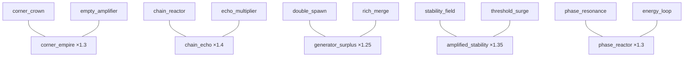
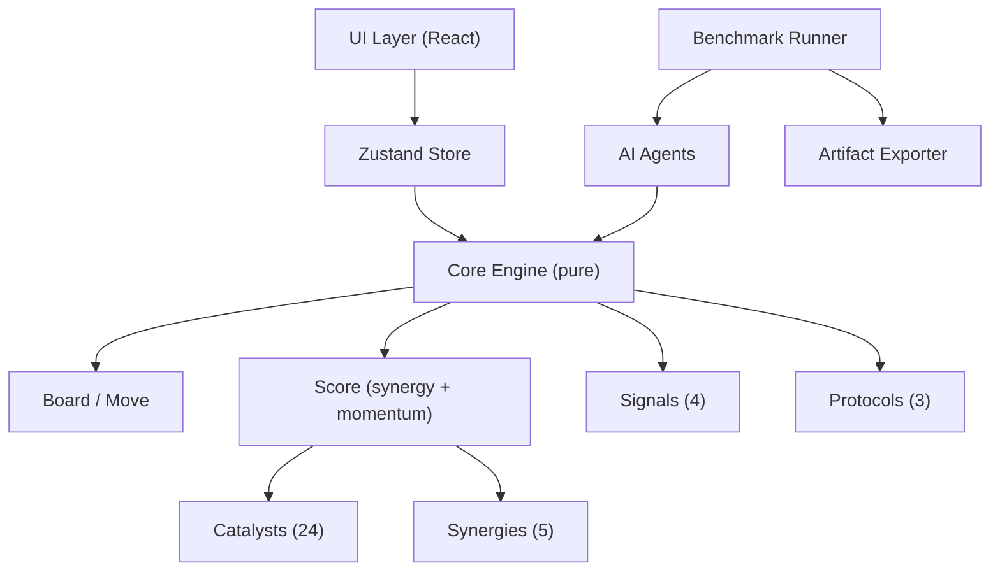
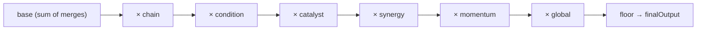
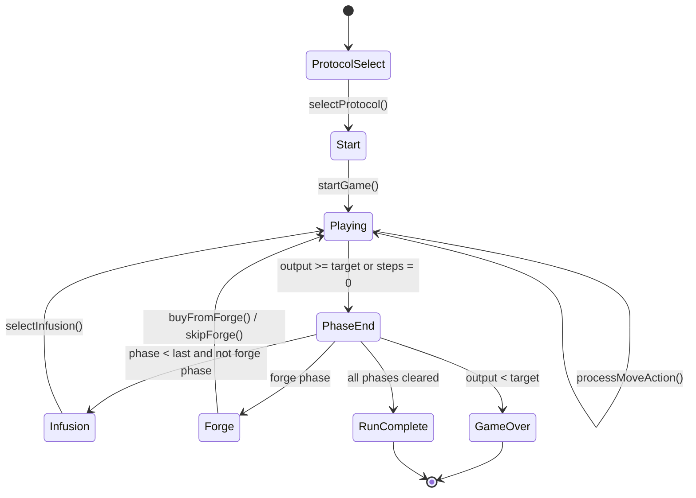
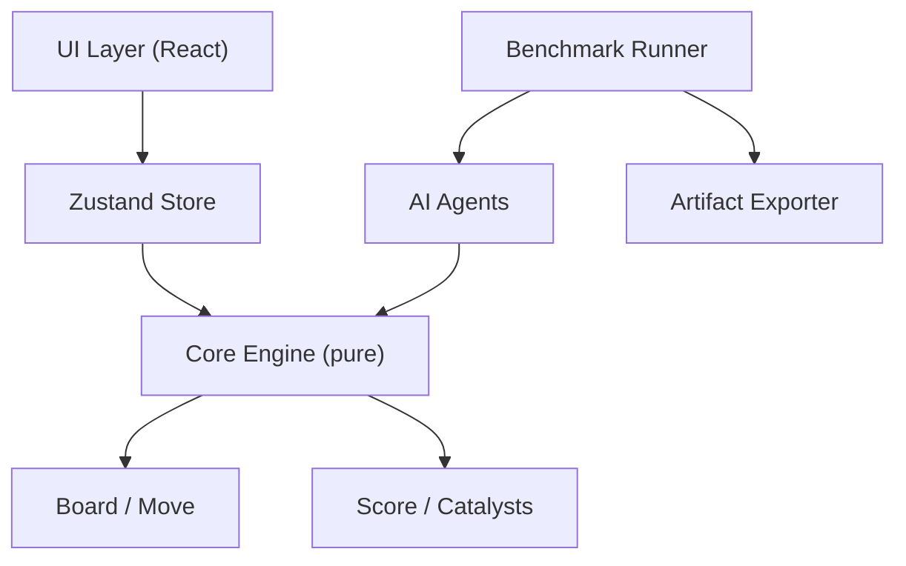
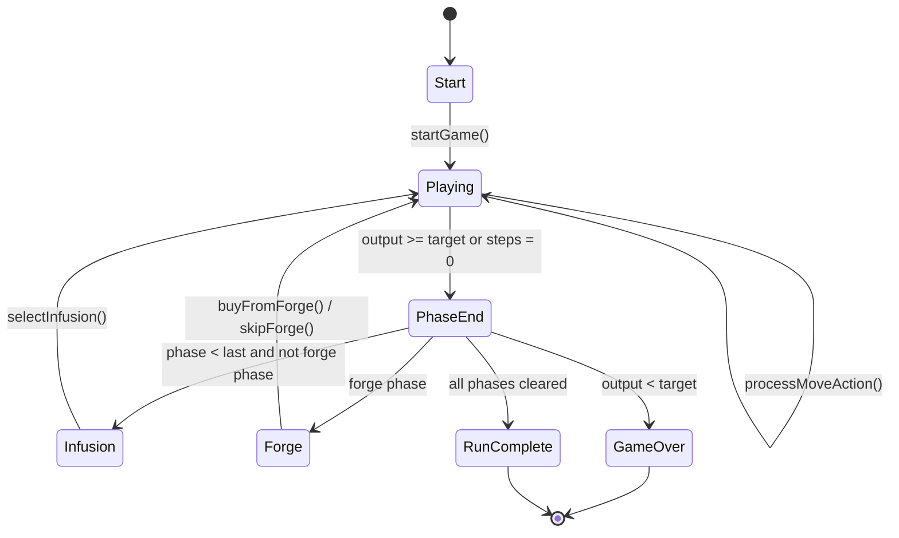
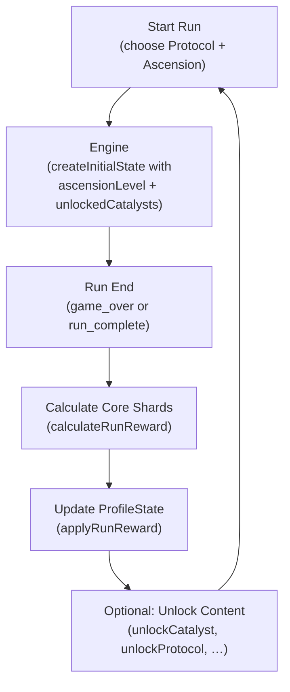
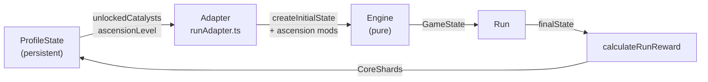
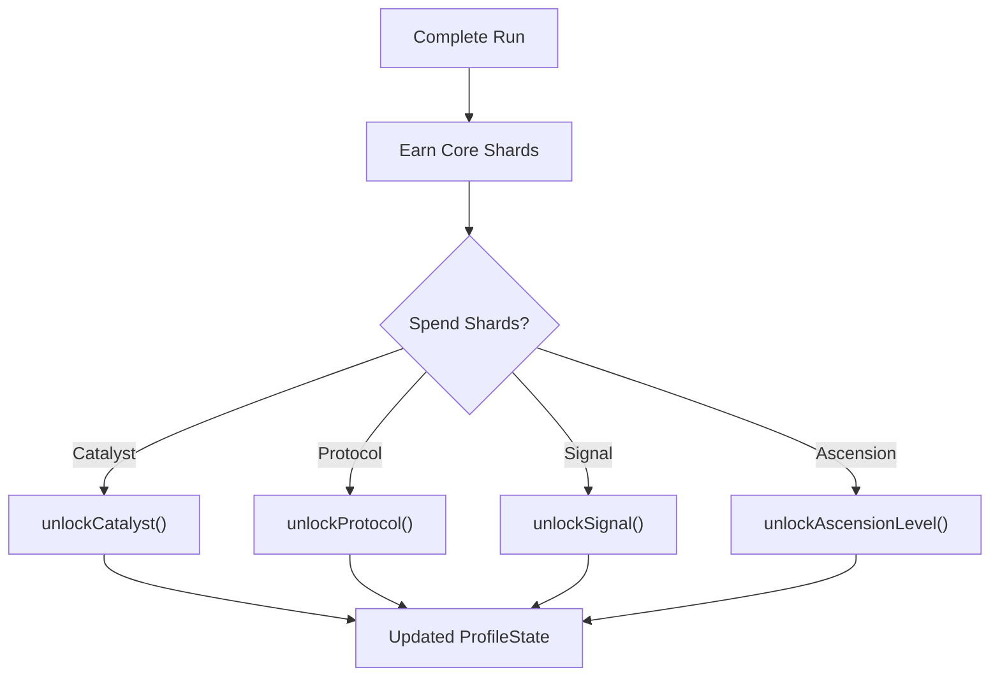

# Merge Catalyst — Design Document

## Overview

Merge Catalyst is a roguelike puzzle game built on a discrete tile-merge grid.  The player progresses through **endless rounds**, each containing 6 Phases.  After every phase, the player enters an **Intermission**: first choosing an Infusion reward, then optionally shopping at the Forge.  Two Anomaly phases per round add asymmetric challenges.  Rounds scale in difficulty — targets increase by 12% per round — so score-chasing runs grow progressively more demanding.

The player-facing tile visuals are driven by a **pluggable theme layer** — the default shell uses a generic progression ladder (Seed → Singularity) rather than raw numeric labels.  Core game logic always operates on internal power-of-two values; the theme layer is purely presentational.

It also ships a complete **benchmark-aware simulation framework** that allows AI agents to play the game headlessly, batch simulations to run for balance analysis, and results to be exported for review.

---

## Terminology

| Term | Meaning |
|------|---------|
| Catalyst | Power-up modifier |
| Category | Catalyst classification (Amplifier / Stabilizer / Generator / Modifier / Legacy) |
| Signal | One-time-use tactical ability |
| Protocol | Immutable base ruleset selected at run start |
| RunStakes | Descriptor tag on a Protocol expressing how demanding its ruleset is (`standard` / `tactical` / `overclocked`) |
| Phase | One stage within a round (6 phases = 1 round) |
| Round | Group of 6 phases; runs continue across rounds endlessly |
| Anomaly | Special challenge modifier active during certain phases |
| Forge | Shop for buying Catalysts (available after every phase via Intermission) |
| Intermission | Post-phase node: Infusion choice followed by Forge access |
| Infusion | Post-phase reward choice |
| Energy | Currency for the Forge |
| Output | Score |
| Steps | Moves remaining |
| Grid | 4×4 play field |
| Reaction Log | Move history log |
| Synergy | Bonus from holding two complementary Catalysts |
| Momentum | Multiplier that grows with consecutive valid moves |

---

## Core Loop

```
Select Protocol
  ↓
Start Run (Round 1)
  ↓
Phase N (Playing)
  ↓ (output ≥ target OR steps = 0)
Phase End
  ├── loss (output < target, steps = 0) → Game Over
  ├── pass (not last phase) → Infusion → Forge (skip allowed) → Phase N+1
  └── pass (last phase = phase 6) → Round Complete → Round N+1
                                              (run continues, never auto-ends)
```

The run continues indefinitely — there is **no final round**.  The run ends only when the player fails a phase (output < target when steps reach 0).

---

## Grid Rules

- 4×4 grid
- Standard 2048 merge: tiles of equal value combine into their sum
- Each tile merges only once per move
- A new tile spawns only if the move changed the grid
- Default spawn: 90% chance of 2, 10% chance of 4

---

## Round & Phase Structure

### Endless Round Model

```
Round 1 → 6 phases → Round Complete → Round 2 → 6 phases → Round Complete → …
```

- Every **6 phases** form one **round**.
- After the 6th phase passes, the player sees the **Round Complete** screen, then the run continues into the next round.
- Phase targets scale with `ROUND_TARGET_SCALE = 0.12` (12% harder per round).
- Templates rotate every 3 rounds: Round 1 = alpha, Round 2 = beta, Round 3 = gamma, Round 4 = alpha (scaled), …

### Round Templates

Three named templates define different 6-phase structures:

| Template | ID | Flavour |
|----------|----|---------|
| Standard Circuit | `alpha` | Balanced ramp; two anomaly climaxes |
| Pressure Gauntlet | `beta` | Anomalies arrive early and often |
| Economic Surge | `gamma` | Long phases reward patient economy |

Each template specifies per-phase: `targetOutput`, `steps`, optional `anomaly`, `challengeTier`, and `modifier`.

### Phase Roles (across all templates)

| Role | Purpose |
|------|---------|
| Opener | Low target; get the board moving |
| Economy | Longer steps; build energy and catalysts |
| Combo Pressure | Moderate target; chain bonuses are needed |
| Anomaly Pressure | Anomaly active; survive with existing build |
| Recovery / Spike | High steps or high target; push score |
| Climax | Final phase of the round; boss-tier challenge |

### Intermission (Post-Phase Flow)

After every phase clear:
1. **Infusion** screen — choose one of 2–3 rewards (catalyst / energy / steps / multiplier).
2. **Forge** screen — optionally buy a catalyst.  "Skip Forge" proceeds immediately.
3. **Playing** — next phase begins with a fresh grid.

```
Phase End (pass)
  → Infusion (choose reward)
  → Forge (buy or skip)
  → Playing (next phase)
```

---

## Presentation Layer Abstraction

### Core Engine vs Player-Facing Shell

```
┌─────────────────────────────────┐
│   Core Engine (src/core/)       │
│   Internal numeric values only  │
│   2 / 4 / 8 / 16 / …           │
│   Score = raw integers          │
└────────────┬────────────────────┘
             │ internalValue
             ▼
┌─────────────────────────────────┐
│   Theme Layer (src/theme/)      │
│   TileTheme → TileThemeEntry    │
│   displayLabel / colorToken /   │
│   iconToken / rarityTag         │
└────────────┬────────────────────┘
             │ display label + colour
             ▼
┌─────────────────────────────────┐
│   UI (src/ui/)                  │
│   Tile.tsx renders theme entry  │
│   scoreDisplay.ts scales output │
└─────────────────────────────────┘
```

- **Core engine** operates exclusively on internal numeric values.  No theme imports appear in `src/core/`.
- **Theme layer** maps each `internalValue` to `displayLabel`, `colorToken`, `iconToken`, and `rarityTag`.
- **UI layer** reads the active theme from `useThemeStore` and renders the themed presentation.  An optional `showInternalValue` prop on `<Tile>` shows the raw numeric value as a small debug badge.
- **Benchmark and AI agents** are unaffected by themes — they only see raw numeric game state.

### rawOutput vs displayOutput

| Field | Meaning | Where used |
|-------|---------|-----------|
| `finalOutput` / `rawOutput` | Internal score value (unchanged) | Engine, benchmark, AI agents |
| `displayOutput` | `rawOutput × DISPLAY_SCORE_SCALE` | UI panels, end screen |

`DISPLAY_SCORE_SCALE` (default 10, defined in `src/core/config.ts`) makes numbers feel more rewarding without touching game mechanics.  Benchmark reports always reference raw output.

### Theme Registry

```
src/theme/
  types.ts           — TileThemeEntry + TileTheme interfaces
  defaultTheme.ts    — Default progression theme
  progressionTheme.ts — Re-export alias
  mathTheme.ts       — Placeholder (math/science)
  historyTheme.ts    — Placeholder (history/civilisation)
  cultureTheme.ts    — Placeholder (internet culture)
  themeRegistry.ts   — THEME_REGISTRY map + useThemeStore
```

New themes can be added by:
1. Creating a new `src/theme/myTheme.ts` exporting a `TileTheme`.
2. Adding it to `THEME_REGISTRY` in `themeRegistry.ts`.
3. Calling `useThemeStore.getState().setTheme('myThemeId')` to activate it.

---

## Scoring Formula

```
finalOutput = floor(base × chain × condition × catalyst × synergy × momentum × global)
```

### Base
Sum of merged tile values in that move.

### Chain Multiplier
| Merges | Default Multiplier |
|--------|-----------|
| 1 | 1.0 |
| 2 | 1.2 |
| 3 | 1.5 |
| 4+ | 2.0 |

With **Chain Reactor** catalyst active, the chain multiplier scales linearly: `1.0 + (N-1) × 1.2`.

### Condition Multipliers
- Corner merge (destination is a corner cell): ×1.2
- Highest tile merge (result exceeds prior max): ×1.2
- Both conditions stack multiplicatively.

### Catalyst Multipliers
Applied from active Catalysts (see below). Each catalyst triggers according to its `trigger` type and `effectParams`.

### Synergy Multiplier
When two complementary Catalysts are both active, a Synergy bonus is applied. See Synergy System section.

### Momentum Multiplier
Grows with consecutive valid (scoring) moves. Resets on phase start. See Momentum System section.

### Global Multiplier
Starts at 1.0. Increased by +0.1 for each Infusion multiplier choice taken. Also scaled by Protocol `outputScale`.

---

## Catalyst Categories

### Amplifier (score multipliers)
Boost Output through various scaling mechanisms.

| ID | Name | Rarity | Cost | Effect |
|----|------|--------|------|--------|
| empty_amplifier | Empty Amplifier | Common | 3 | +0.05× Output per empty cell |
| chain_reactor | Chain Reactor | Rare | 5 | Chain scales ×0.2 per extra merge |
| echo_multiplier | Echo Multiplier | Rare | 5 | Carry 20% of last move's Output |
| threshold_surge | Threshold Surge | Rare | 5 | ×1.5 if base > 30 |
| phase_resonance | Phase Resonance | Epic | 7 | +0.1× per phase index |

### Stabilizer (board control)
Help maintain a clean, controllable board state.

| ID | Name | Rarity | Cost | Effect |
|----|------|--------|------|--------|
| gravity_well | Gravity Well | Common | 3 | ×1.1 if merge at corner |
| soft_reset | Soft Reset | Rare | 5 | Remove lowest tile once per run |
| buffer_zone | Buffer Zone | Common | 3 | Row 0 blocked from spawns |
| merge_shield | Merge Shield | Epic | 7 | Absorbs phase failure every 5 moves |
| stability_field | Stability Field | Rare | 5 | ×1.2 after 3 consecutive valid moves |

### Generator (resource / spawn)
Convert actions into energy and spawn additional resources.

| ID | Name | Rarity | Cost | Effect |
|----|------|--------|------|--------|
| double_spawn | Double Spawn | Common | 3 | 25% chance to spawn 2 tiles |
| rich_merge | Rich Merge | Rare | 5 | +1 Energy per merge |
| catalyst_echo | Catalyst Echo | Epic | 7 | Duplicate weakest catalyst effect once/phase |
| energy_loop | Energy Loop | Rare | 5 | 10% of Output converts to Energy |
| reserve_bank | Reserve Bank | Common | 3 | +1 Energy per step used at phase clear |

### Modifier (rule changes)
Alter fundamental game mechanics.

| ID | Name | Rarity | Cost | Effect |
|----|------|--------|------|--------|
| diagonal_merge | Diagonal Merge | Epic | 7 | ×1.2 on every 4th move |
| split_protocol | Split Protocol | Epic | 7 | Split highest tile once per phase |
| inversion_field | Inversion Field | Rare | 5 | ×1.15 Output always |
| overflow_grid | Overflow Grid | Epic | 7 | +2 virtual empty cells once per run |
| delay_spawn | Delay Spawn | Rare | 5 | Skip spawn; double next spawn |
| anomaly_sync | Anomaly Sync | Epic | 7 | ×1.3 when anomaly triggers |

### Legacy (original 8)
The original 8 catalysts retain full compatibility.

| ID | Name | Rarity | Cost | Effect |
|----|------|--------|------|--------|
| corner_crown | Corner Crown | Rare | 5 | Corner merges ×2 Output |
| twin_burst | Twin Burst | Common | 3 | ≥2 merges ×1.5 Output |
| lucky_seed | Lucky Seed | Common | 3 | Spawn: 75% 2, 25% 4 |
| bankers_edge | Banker's Edge | Common | 3 | +2 Energy on phase clear |
| reserve | Reserve | Rare | 5 | +20 Output per unused step on clear |
| frozen_cell | Frozen Cell | Common | 3 | Cell (1,1) blocked from spawns |
| combo_wire | Combo Wire | Rare | 5 | 3 consecutive moves → ×1.3 |
| high_tribute | High Tribute | Rare | 5 | Highest tile merge → ×1.4 |

---

## Synergy System

When two complementary Catalysts are both active simultaneously, a **Synergy** bonus multiplier is applied to Output.

### Defined Synergies

| Synergy ID | Catalysts | Multiplier | Description |
|-----------|-----------|-----------|-------------|
| corner_empire | corner_crown + empty_amplifier | ×1.3 | Empty board space amplifies corner dominance |
| chain_echo | chain_reactor + echo_multiplier | ×1.4 | Chain length echoes into next move |
| generator_surplus | double_spawn + rich_merge | ×1.25 | Extra tiles convert directly to energy |
| amplified_stability | stability_field + threshold_surge | ×1.35 | Stable board unlocks surge multiplier |
| phase_reactor | phase_resonance + energy_loop | ×1.3 | Late-phase output feeds energy loop |

Synergy bonuses stack multiplicatively if multiple synergies are active.



---

## Momentum System

- Each consecutive valid (scoring) move increments momentum
- Momentum multiplier = `min(1.0 + N × 0.05, 2.0)` where N = consecutive valid moves
- Resets to 1.0 at the start of each phase (after Infusion / Forge)
- A "valid move" is any move that produces at least 1 Output

---

## Signal System

Signals are **one-time-use tactical abilities** within a run. They are consumable items stored in `RunState`.

### Signal Capacity
- Maximum 2 slots per run
- Signals are consumed on use

### Available Signals

| ID | Name | Effect |
|----|------|--------|
| pulse_boost | Pulse Boost | Current move Output ×2 |
| grid_clean | Grid Clean | Remove 2 lowest-value tiles |
| chain_trigger | Chain Trigger | Force one additional merge resolution |
| freeze_step | Freeze Step | Skip tile spawn this turn |

### Usage Flow
1. Signals are obtained via Infusion rewards
2. Player queues a signal before making a move (clicks the signal button in the UI)
3. The signal activates when the next move is processed
4. Signal is removed from inventory after use
5. Effect and signal name are recorded in the `ReactionLogEntry`

---

## Protocol System

Protocols define the **immutable base ruleset** for a run, selected at run start and fixed throughout.

### Pre-Run Selection UI

The Start Screen shows a **Protocol Selection** grid with a card for each protocol.  Each card displays:
- **Icon** (emoji) — from `ProtocolDef.icon`
- **Name** — from i18n key `protocol.<id>.name`
- **Description** — from i18n key `protocol.<id>.description`
- **Difficulty badge** — from `ProtocolDef.difficulty`, styled with a semantic colour

The difficulty badge comes directly from the protocol definition — there is no separate mapping in the UI component.

### Available Protocols

| Icon | ID | Name | Difficulty | Effect |
|---|---|---|---|---|
| 📐 | corner_protocol | Corner Protocol | Standard | Corner merges gain extra ×1.5 multiplier |
| 🌑 | sparse_protocol | Sparse Protocol | Tactical | Start with 1 tile; spawn freq halved; output ×1.2 |
| ⚡ | overload_protocol | Overload Protocol | Overclocked | Output ×1.4 but each phase has 2 fewer steps |

### Protocol Fields

Each `ProtocolDef` defines:
- `icon`: emoji displayed on the selection card
- `difficulty`: `'standard' | 'tactical' | 'overclocked'` — the difficulty tier
- `cornerMultiplier`: extra corner bonus
- `startTiles`: initial tiles placed (1 or 2)
- `spawnFrequencyFactor`: >1 = less frequent spawns (implemented via chance)
- `outputScale`: global output scaling
- `stepsReduction`: steps removed from each phase

### Adding a New Protocol

1. Add the `ProtocolId` literal to `src/core/types.ts`
2. Add the `ProtocolDef` (with `icon` and `difficulty`) to `src/core/protocols.ts`
3. Add i18n keys `protocol.<id>.name` and `protocol.<id>.description` to `en.ts` / `zh-CN.ts`
4. The protocol will appear automatically on the Start Screen

---

## Anomalies

### Entropy Tax (Phase 4)
- Before each move, 1 random empty cell is blocked from receiving a spawn tile.
- The blocked cell is highlighted in the UI.

### Collapse Field (Phase 6)
- Every 4 valid moves, the highest tile on the grid is reduced by one level (value / 2).
- Counter resets per phase.

---

## Balance v3 Changes

Introduced in Balance v3 (`balanceVersion: "v3"`, see `src/core/config.ts`).

### New Systems
- 16 new Catalysts across 4 categories (total: 24)
- Signal system (4 one-time abilities)
- Protocol system (3 run modifiers)
- Synergy system (5 catalyst pair bonuses)
- Momentum system (consecutive move scaling)

### Score Formula Extension
Formula extended from `base × chain × condition × catalyst × global` to:
`base × chain × condition × catalyst × synergy × momentum × global`

---

## Forge (Between Phase 3 and 4)

- 3 random Catalyst offers shown
- Player may buy any (if affordable) or reroll
- Reroll costs 1 Energy
- If all 3 slots are full, player must choose which Catalyst to replace
- Player may skip the Forge entirely at no cost
- Grid resets (protocol.startTiles fresh tiles) when entering Phase 4

---

## Infusion (After Each Phase Clear)

Player chooses one of up to 4 options:
1. **Gain a Catalyst** — add a random catalyst not already active (if < 3 slots)
2. **Gain 3 Energy** — adds 3 to energy reserve
3. **Gain +2 Steps** — adds 2 steps to the next phase's step limit
4. **+10% Global Multiplier** — increments globalMultiplier by 0.1

---

## Reaction Log

Each valid move records:
- `step`: which step number this was
- `action`: direction (up/down/left/right)
- `gridBefore`, `gridAfter`: full grid snapshots
- `merges`: list of merge events with positions and values
- `spawn`: position of the newly spawned tile (or null)
- `anomalyEffect`: description of any anomaly effect that fired
- `base`, `multipliers`, `finalOutput`: scoring breakdown
- `triggeredCatalysts`: list of catalyst IDs that activated
- `synergyMultiplier`: combined synergy bonus for this move
- `triggeredSynergies`: list of synergy IDs that activated
- `momentumMultiplier`: current momentum multiplier at time of move
- `signalUsed`: signal ID consumed this move (or null)
- `signalEffect`: description of the signal's effect (or null)

The UI displays the last 10 log entries.

---

## RNG

Uses a seeded xorshift32 PRNG. Seed is derived from `Date.now()` at game start. The seed advances per move to ensure reproducibility within a run while varying across runs. Benchmark runs use fixed seeds for deterministic comparisons.

---

## Benchmark-Aware Architecture

The core engine (`src/core/`) is **pure** — no React, no browser APIs, no side effects. This allows it to be imported by Node.js benchmark scripts directly.

```
src/
  core/          Pure game logic (no browser dependencies)
    catalysts.ts    24 catalyst definitions
    signals.ts      4 signal definitions
    protocols.ts    3 protocol definitions
    synergies.ts    5 synergy definitions
    score.ts        Extended scoring (synergy + momentum)
    engine.ts       Game engine (signals, protocols, momentum)
    config.ts       All tuning constants
  ai/            Headless AI agents and policy evaluation
  benchmark/     Simulation runner, metrics, exporters, charts
  scripts/       CLI entrypoints (tsx / npm scripts)
  ui/            React UI (browser only)
  store/         Zustand store (browser only)
```

---

## Balancing Philosophy

- **Centralized config**: all tuning knobs live in `src/core/config.ts`
- **Benchmark-driven tuning**: run `npm run balance` to check win rates and catalyst stats
- **Agent distinction**: if HeuristicAgent and RandomAgent score similarly, the game lacks depth
- **Phase ramp**: each phase should feel meaningfully harder, not just step-limited
- See [BALANCE.md](BALANCE.md) for the full tuning guide

---

## System Architecture Diagram



## Scoring Pipeline



## Game Flow Diagram



---

## UI Components

The React UI renders the game state from the Zustand store. Key panels:

| Component | Location | Purpose |
|-----------|----------|---------|
| `Header` | Top bar | Phase, Output, Steps, Energy, Protocol badge, Momentum, Locale switcher |
| `PhasePanel` | Left column | Phase progress bar + Anomaly info |
| `ProtocolPanel` | Left column | Active Protocol name and description |
| `MomentumBar` | Left column | Visual momentum multiplier meter |
| `CatalystPanel` | Left column | Active Catalysts with category tags |
| `SynergyPanel` | Left column | Active Synergies + Build identity label |
| `SignalPanel` | Left column | Available Signals with Use buttons |
| `OutputPanel` | Left column | Last move score breakdown |
| `GridView` | Center | 4×4 game board |
| `ControlPad` | Center | On-screen arrow controls |
| `LogPanel` | Right column | Reaction log (last 10 moves) |
| `ForgeModal` | Overlay | Catalyst shop with category tags and synergy hints |
| `InfusionModal` | Overlay | Post-phase reward choice with playstyle tags |
| `HelpOverlay` | Overlay | In-game help (systems explanation) |
| `LocaleSwitcher` | Header | Toggle EN / 中文 |

---

## Localization (i18n)

All player-facing strings are extracted to `src/i18n/`.

```
src/i18n/
  types.ts      — Locale + TranslationMap types
  en.ts         — English translations (default)
  zh-CN.ts      — Simplified Chinese translations
  index.ts      — useT() hook, createT() factory, Zustand locale store
```

Translation keys are grouped by domain:
- `ui.*` — UI labels, buttons, panel titles, screen text
- `catalyst.*` — Catalyst names and descriptions
- `signal.*` — Signal names and descriptions
- `protocol.*` — Protocol names and descriptions
- `anomaly.*` — Anomaly names and descriptions
- `synergy.*` — Synergy names and descriptions
- `tag.*` — Category/playstyle tag labels
- `locale.*` — Locale switcher labels

Adding a new language: create `src/i18n/<locale>.ts`, add it to `TRANSLATIONS` in `index.ts`, extend the `Locale` union in `types.ts`.

---

## Tech Stack

- **React 18** — UI rendering
- **Vite 5** — dev server and bundler
- **TypeScript 5** — type safety
- **Zustand 4** — minimal global state management (game + locale)
- **tsx** — TypeScript runner for headless scripts


## Overview

Merge Catalyst is a roguelike puzzle game built on 2048-style grid mechanics. The player progresses through 6 Phases, each with an Output target and step limit. Between Phase 3 and 4, the Forge allows purchasing Catalysts. After each phase, an Infusion reward is offered. Two Anomaly phases add asymmetric challenges.

It also ships a complete **benchmark-aware simulation framework** that allows AI agents to play the game headlessly, batch simulations to run for balance analysis, and results to be exported for review.

---

## Terminology

| Term | Meaning |
|------|---------|
| Catalyst | Power-up modifier |
| Phase | Game stage/level |
| Anomaly | Special challenge modifier |
| Forge | Shop for buying Catalysts |
| Infusion | Post-phase reward |
| Energy | Currency for the Forge |
| Output | Score |
| Steps | Moves remaining |
| Grid | 4×4 play field |
| Reaction Log | Move history log |

---

## Core Loop

```
Start Run
  ↓
Phase N (Playing)
  ↓ (output ≥ target OR steps = 0)
Phase End
  ├── loss → Game Over
  ├── forge phase → Forge screen → Phase N+1
  ├── last phase won → Run Complete
  └── otherwise → Infusion → Phase N+1
```

---

## Grid Rules

- 4×4 grid
- Standard 2048 merge: tiles of equal value combine into their sum
- Each tile merges only once per move
- A new tile spawns only if the move changed the grid
- Default spawn: 90% chance of 2, 10% chance of 4

---

## Phase Structure

```
Phase 1: targetOutput=70,  steps=12
Phase 2: targetOutput=80,  steps=12
Phase 3: targetOutput=75,  steps=10
→ Forge Phase (between 3 and 4)
Phase 4: targetOutput=40,  steps=8   [Anomaly: Entropy Tax]
Phase 5: targetOutput=80,  steps=10
Phase 6: targetOutput=55,  steps=8   [Anomaly: Collapse Field]
```

All phase values are centralised in `src/core/config.ts` for easy tuning.

---

## Scoring Formula

```
finalOutput = floor(base × chain × condition × catalyst × global)
```

### Base
Sum of merged tile values in that move.

### Chain Multiplier
| Merges | Multiplier |
|--------|-----------|
| 1 | 1.0 |
| 2 | 1.2 |
| 3 | 1.5 |
| 4+ | 2.0 |

### Condition Multipliers
- Corner merge (destination is a corner cell): ×1.2
- Highest tile merge (result exceeds prior max): ×1.2
- Both conditions stack multiplicatively.

### Catalyst Multipliers
Applied from active Catalysts (see below).

### Global Multiplier
Starts at 1.0. Increased by +0.1 for each Infusion multiplier choice taken.

---

## Catalysts (8 total, max 3 active)

| ID | Name | Rarity | Cost | Effect |
|----|------|--------|------|--------|
| corner_crown | Corner Crown | Rare | 5 | Corner merges × 2.0 Output |
| twin_burst | Twin Burst | Common | 3 | ≥2 merges in a move × 1.5 Output |
| lucky_seed | Lucky Seed | Common | 3 | Spawn: 75% 2, 25% 4 |
| bankers_edge | Banker's Edge | Common | 3 | +2 Energy on phase clear |
| reserve | Reserve | Rare | 5 | +20 Output per unused step on phase clear |
| frozen_cell | Frozen Cell | Common | 3 | One cell (1,1) cannot spawn tiles |
| combo_wire | Combo Wire | Rare | 5 | 3 consecutive scoring moves → × 1.3 Output |
| high_tribute | High Tribute | Rare | 5 | Highest tile merge → × 1.4 Output |

---

## Anomalies

### Entropy Tax (Phase 4)
- Before each move, 1 random empty cell is blocked from receiving a spawn tile.
- The blocked cell is highlighted in the UI.

### Collapse Field (Phase 6)
- Every 4 valid moves, the highest tile on the grid is reduced by one level (value / 2).
- Counter resets per phase.

---

## Balance v2 Changes

Introduced in Balance v2 (`balanceVersion: "v2"`, see `src/core/config.ts`).

### Phase Target Reductions

All phase `targetOutput` values were significantly reduced to make the game reachable for AI agents and human players. The original targets were unreachable for all tested agents.

| Phase | Target v1 | Target v2 | Steps |
|-------|-----------|-----------|-------|
| 1 | 120 | 70 | 12 |
| 2 | 260 | 80 | 12 |
| 3 | 500 | 75 | 10 |
| 4 (Entropy Tax) | 900 | 40 | 8 |
| 5 | 1400 | 80 | 10 |
| 6 (Collapse Field) | 2200 | 55 | 8 |

### Collapse Field Period

`COLLAPSE_FIELD_PERIOD` increased from 3 → 4 (every 4 scoring moves instead of 3), reducing the intensity of the Phase 6 anomaly.

### Benchmark Runner Fixes

- `autoInfusion`: now prefers a **catalyst** slot when under the `MAX_CATALYSTS` cap; at cap it prefers **+2 steps** → multiplier → energy (avoids wasting a slot on an unusable catalyst choice).
- `autoForge`: after buying the cheapest affordable catalyst, now always calls `skipForge()` so the screen advances to `playing` (the previous version left the runner stuck on the forge screen when no purchase was made).

### Architecture: Single Source of Truth

`src/core/phases.ts` no longer duplicates phase data. It now re-exports `PHASES` directly from `PHASE_CONFIG` in `src/core/config.ts`.

---

## Forge (Between Phase 3 and 4)

- 3 random Catalyst offers shown
- Player may buy any (if affordable) or reroll
- Reroll costs 1 Energy
- If all 3 slots are full, player must choose which Catalyst to replace
- Player may skip the Forge entirely at no cost
- Grid resets (2 fresh tiles) when entering Phase 4

---

## Infusion (After Each Phase Clear)

Player chooses one of up to 4 options:
1. **Gain a Catalyst** — add a random catalyst not already active (if < 3 slots)
2. **Gain 3 Energy** — adds 3 to energy reserve
3. **Gain +2 Steps** — adds 2 steps to the next phase's step limit
4. **+10% Global Multiplier** — increments globalMultiplier by 0.1

---

## Reaction Log

Each valid move records:
- `step`: which step number this was
- `action`: direction (up/down/left/right)
- `gridBefore`, `gridAfter`: full grid snapshots
- `merges`: list of merge events with positions and values
- `spawn`: position of the newly spawned tile (or null)
- `anomalyEffect`: description of any anomaly effect that fired
- `base`, `multipliers`, `finalOutput`: scoring breakdown
- `triggeredCatalysts`: list of catalyst IDs that activated

The UI displays the last 10 log entries.

---

## RNG

Uses a seeded xorshift32 PRNG. Seed is derived from `Date.now()` at game start. The seed advances per move to ensure reproducibility within a run while varying across runs. Benchmark runs use fixed seeds for deterministic comparisons.

---

## Benchmark-Aware Architecture

The core engine (`src/core/`) is **pure** — no React, no browser APIs, no side effects. This allows it to be imported by Node.js benchmark scripts directly.

```
src/
  core/          Pure game logic (no browser dependencies)
  ai/            Headless AI agents and policy evaluation
  benchmark/     Simulation runner, metrics, exporters, charts
  scripts/       CLI entrypoints (tsx / npm scripts)
  ui/            React UI (browser only)
  store/         Zustand store (browser only)
```

### Headless Simulation Design

`runSingle(opts)` in `src/benchmark/runner.ts`:
1. Creates a game state with a fixed seed
2. Calls `agent.nextAction(state)` each step
3. Handles infusion/forge screens automatically
4. Collects `RunMetrics` at the end

`runBatch(opts)` loops `runSingle` over N seeds.

Agents only depend on `src/core/` and `src/ai/`. They import no browser code.

---

## Balancing Philosophy

- **Centralized config**: all tuning knobs live in `src/core/config.ts`
- **Benchmark-driven tuning**: run `npm run balance` to check win rates and catalyst stats
- **Agent distinction**: if HeuristicAgent and RandomAgent score similarly, the game lacks depth
- **Phase ramp**: each phase should feel meaningfully harder, not just step-limited
- See [BALANCE.md](BALANCE.md) for the full tuning guide

---

## Architecture Diagram



## Game Flow Diagram



---

## Tech Stack

- **React 18** — UI rendering
- **Vite 5** — dev server and bundler
- **TypeScript 5** — type safety
- **Zustand 4** — minimal global state management
- **tsx** — TypeScript runner for headless scripts


---

## Meta Progression System

### Overview

The meta progression layer transforms Merge Catalyst from a single-run prototype into a replayable, progression-based roguelike with three interlocking systems:

1. **Unlock System** — content unlocked over multiple runs
2. **Difficulty System (Ascension)** — 9 scaling difficulty tiers (0–8)
3. **Meta Currency (Core Shards)** — long-term resource used for unlocks

These systems are implemented as an **adapter layer** (`src/core/runAdapter.ts`) that wraps the pure engine. The engine itself remains stateless and pure.

---

### ProfileState

`ProfileState` is the persistent player record, kept separate from `GameState`:

```ts
interface ProfileState {
  unlockedCatalysts:     CatalystId[];
  unlockedSignals:       SignalId[];
  unlockedProtocols:     ProtocolId[];
  unlockedAnomalies:     AnomalyId[];
  unlockedAscensionLevel: AscensionLevel;
  metaCurrency:          number;          // Core Shards
}
```

The default profile (`DEFAULT_PROFILE` in `src/core/profile.ts`) unlocks only:
- The 8 legacy catalysts
- `corner_protocol`
- Both anomalies (always in play)

### Persistence (localStorage)

Profile progress is stored in `localStorage` under key `merge_catalyst_progress`.

**Initialization logic** (`src/store/profileStore.ts`):
```
On startup:
  if localStorage["merge_catalyst_progress"] exists
    → parse and merge with DEFAULT_PROFILE (forward-compat with new fields)
  else
    → use DEFAULT_PROFILE (8 legacy catalysts only)

?debug=unlock_all in URL
    → treat all catalysts as unlocked (dev/playtesting only)
```

This ensures:
- **First visit / incognito mode** → only starter catalysts are unlocked
- **Returning visit** → progress is restored from storage
- **Corrupt data** → silently falls back to DEFAULT_PROFILE

---

### Unlock Philosophy

Unlocks are **intentional long-term gates**, not time gates.

- **Why unlock?** To give experienced players access to more powerful and varied builds.
- **What is locked by default?** All 16 advanced catalysts, 2 alternative protocols, all 4 signals.
- **How to unlock?** Spend Core Shards (`src/core/unlockConfig.ts`).

| Content | Cost |
|---------|------|
| Common catalyst | 15 Core Shards |
| Rare catalyst | 25 Core Shards |
| Epic catalyst | 40 Core Shards |
| Protocol | 30 Core Shards |
| Signal | 20 Core Shards |
| Ascension level N | N × 20 Core Shards |

The Forge and Infusion rewards only show catalysts the player has unlocked.
Benchmark mode can bypass this restriction (`ignoreUnlocks: true`) for full-pool runs.

---

### Ascension Philosophy

Ascension (0–8) is Merge Catalyst's difficulty scaling, inspired by Slay the Spire / Balatro stakes.

- **Level 0** = baseline (identical to pre-meta-progression behaviour).
- **Levels 1–7** = each level adds one new penalty, stacking cumulatively.
- **Level 8** = combined maximum penalties.

Players unlock ascension levels with Core Shards. A fresh profile can only play Ascension 0.

| Level | Cumulative Penalty |
|-------|--------------------|
| 0 | None (baseline) |
| 1 | −1 Step per Phase |
| 2 | +1 + Phase target output ×1.15 |
| 3 | +2 + Anomalies trigger more frequently |
| 4 | +3 + Forge catalyst cost +1 |
| 5 | +4 + Higher "4" spawn probability |
| 6 | +5 + Starting Energy ×0.8 |
| 7 | +6 + Fewer Infusion reward choices |
| 8 | All penalties at maximum intensity |

All values are centralised in `src/core/ascensionModifiers.ts`.

---

### Meta Currency (Core Shards)

Core Shards are earned at the end of every run:

```
reward = base(10) + phases_cleared × 5 + anomaly_cleared × 10 + floor((output − 200) / 100)
```

Config lives in `META_CURRENCY_CONFIG` inside `src/core/unlockConfig.ts`.

---

### Run Loop Integration



---

### Progression Loop Diagram



---

### Unlock Flow Diagram



---

## Round-End Reward System

When a player clears all 6 phases of a round, they see the **Round Complete** screen before entering the next round.

### Round Complete Screen
- Displays: **round number**, **round output** (output gained this round), **cumulative total output**, **best single-move output** this run
- Shows **build summary**: active Catalysts (up to 4 shown) and active Synergies
- Highlights: **MVP Catalyst** (highest rarity equipped) and **Strongest Synergy** (highest multiplier)
- Shows animated **flavor text** (e.g. "System Stabilized", "Chain Reaction Amplified") that cycles per round
- Displays the **Round Reward**: +3 Energy and +5% Global Multiplier
- Contains a pulsing **"Continue Run →"** button and a "New Run" exit button

### Round Reward (config-driven)
| Constant | Value | Effect |
|---|---|---|
| `ROUND_COMPLETE_ENERGY_BONUS` | 3 | +3 Energy granted immediately |
| `ROUND_COMPLETE_MULTIPLIER_BONUS` | 0.05 | +5% global output multiplier |

---

## Milestone System

Milestones fire when the player crosses predefined thresholds, rewarding them with energy or global multiplier bonuses.

### Milestone Types
| Category | Milestones | Reward |
|---|---|---|
| Output | 1k, 5k, 10k, 50k, 100k | Energy or +multiplier |
| Round | Round 3, 5, 10 | Energy or +multiplier |
| Max Tile | 256, 512, 1024, 2048 | Energy or +multiplier |

Milestones are checked after every move via `checkMilestones()` in `src/core/milestones.ts`. Each milestone fires at most once per run. A toast notification slides in from the bottom-right and auto-dismisses after 3 seconds.

---

## Jackpot System

A **Jackpot** is a rare reward that triggers on high-output moves.

- **Probability**: 2% per move (`JACKPOT_PROBABILITY`)
- **Trigger condition**: move output ≥ 50 (`JACKPOT_MIN_OUTPUT`)
- **Effect**: +100 output bonus + +3 energy (`JACKPOT_OUTPUT_BONUS`, `JACKPOT_ENERGY_BONUS`)
- **UI**: Full-screen banner with a bounce-in animation, auto-dismisses after 2.5 seconds

---

## Streak System

A **Streak** tracks consecutive high-output moves (output ≥ `STREAK_MIN_OUTPUT = 5`).

- Each qualifying move increments `streakCount`
- Any move below the threshold resets the streak to 0
- Every 5 consecutive qualifying moves grants +1 Energy (`STREAK_BONUS_THRESHOLD`, `STREAK_ENERGY_BONUS`)
- `bestStreak` is the all-time best streak for the current run, never resets between rounds

---

## Challenge Mode

Challenge runs impose curated rule modifications for a more demanding experience.

### Challenges
| Challenge | Key Rule | Win Condition |
|---|---|---|
| **No Corners** | Corner bonuses disabled | Clear 3 rounds |
| **Energy Starved** | Energy gain × 0.3 | Reach Round 3 |
| **Chain Master** | Only chain-based scoring | Clear 3 rounds |
| **Anomaly Storm** | Anomaly frequency × 2 | Survive 3 rounds |

Challenges are defined in `src/core/challenges.ts`. Each `ChallengeDef` includes a `baseProtocol`, `rules` list, `winCondition`, and `overrides` record. The `overrides` object contains flags that can be applied on top of the base protocol config.

### Challenge Selection Flow
```
Start Screen → "Challenge" button → ChallengeSelectScreen → Select challenge → Run starts
```

---

## Daily Run System

Every day all players share the same seeded run, enabling comparison.

- **Seed generation**: `getDailySeed(dateStr)` hashes the date string `YYYY-MM-DD` to a 32-bit integer
- **Fixed sequence**: same seed → same phase sequence, catalyst pool, anomaly sequence
- **Local leaderboard** (MVP): persisted to `localStorage` under key `merge_catalyst_daily_runs`
- **Records**: best output, best rounds reached, play count per day, kept for 30 days
- **UI**: "Daily Run" button on the Start Screen shows today's date and personal best

