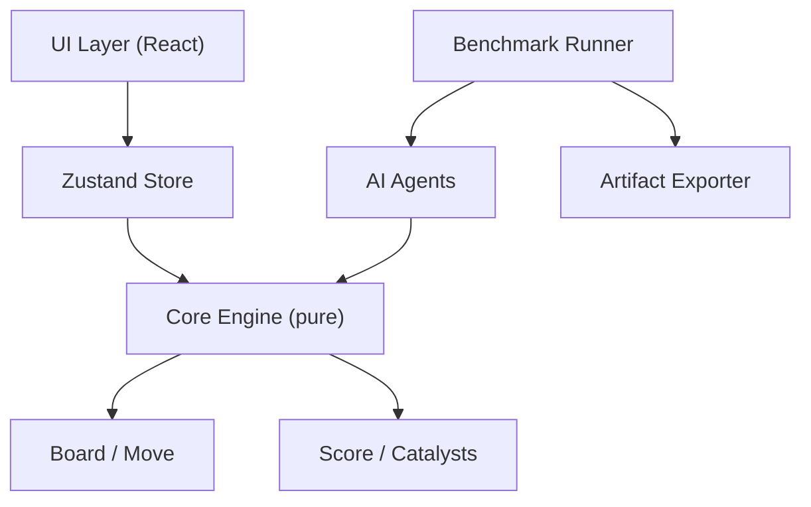
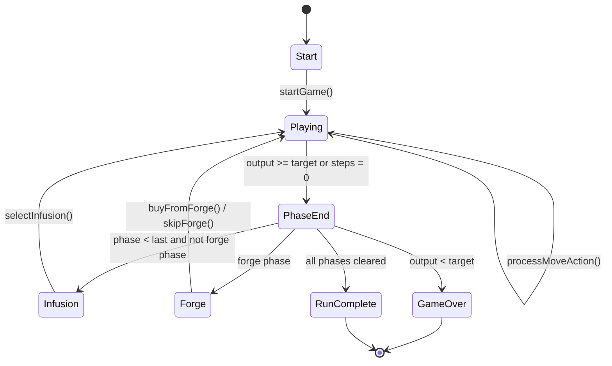

# Merge Catalyst — Design Document

## Overview

Merge Catalyst is a roguelike puzzle game built on 2048-style grid mechanics. The player progresses through 6 Phases, each with an Output target and step limit. Between Phase 3 and 4, the Forge allows purchasing Catalysts. After each phase, an Infusion reward is offered. Two Anomaly phases add asymmetric challenges.

It also ships a complete **benchmark-aware simulation framework** that allows AI agents to play the game headlessly, batch simulations to run for balance analysis, and results to be exported for review.

---

## Terminology

| Term | Meaning |
|------|---------|
| Catalyst | Power-up modifier |
| Phase | Game stage/level |
| Anomaly | Special challenge modifier |
| Forge | Shop for buying Catalysts |
| Infusion | Post-phase reward |
| Energy | Currency for the Forge |
| Output | Score |
| Steps | Moves remaining |
| Grid | 4×4 play field |
| Reaction Log | Move history log |

---

## Core Loop

```
Start Run
  ↓
Phase N (Playing)
  ↓ (output ≥ target OR steps = 0)
Phase End
  ├── loss → Game Over
  ├── forge phase → Forge screen → Phase N+1
  ├── last phase won → Run Complete
  └── otherwise → Infusion → Phase N+1
```

---

## Grid Rules

- 4×4 grid
- Standard 2048 merge: tiles of equal value combine into their sum
- Each tile merges only once per move
- A new tile spawns only if the move changed the grid
- Default spawn: 90% chance of 2, 10% chance of 4

---

## Phase Structure

```
Phase 1: targetOutput=70,  steps=12
Phase 2: targetOutput=80,  steps=12
Phase 3: targetOutput=75,  steps=10
→ Forge Phase (between 3 and 4)
Phase 4: targetOutput=40,  steps=8   [Anomaly: Entropy Tax]
Phase 5: targetOutput=80,  steps=10
Phase 6: targetOutput=55,  steps=8   [Anomaly: Collapse Field]
```

All phase values are centralised in `src/core/config.ts` for easy tuning.

---

## Scoring Formula

```
finalOutput = floor(base × chain × condition × catalyst × global)
```

### Base
Sum of merged tile values in that move.

### Chain Multiplier
| Merges | Multiplier |
|--------|-----------|
| 1 | 1.0 |
| 2 | 1.2 |
| 3 | 1.5 |
| 4+ | 2.0 |

### Condition Multipliers
- Corner merge (destination is a corner cell): ×1.2
- Highest tile merge (result exceeds prior max): ×1.2
- Both conditions stack multiplicatively.

### Catalyst Multipliers
Applied from active Catalysts (see below).

### Global Multiplier
Starts at 1.0. Increased by +0.1 for each Infusion multiplier choice taken.

---

## Catalysts (8 total, max 3 active)

| ID | Name | Rarity | Cost | Effect |
|----|------|--------|------|--------|
| corner_crown | Corner Crown | Rare | 5 | Corner merges × 2.0 Output |
| twin_burst | Twin Burst | Common | 3 | ≥2 merges in a move × 1.5 Output |
| lucky_seed | Lucky Seed | Common | 3 | Spawn: 75% 2, 25% 4 |
| bankers_edge | Banker's Edge | Common | 3 | +2 Energy on phase clear |
| reserve | Reserve | Rare | 5 | +20 Output per unused step on phase clear |
| frozen_cell | Frozen Cell | Common | 3 | One cell (1,1) cannot spawn tiles |
| combo_wire | Combo Wire | Rare | 5 | 3 consecutive scoring moves → × 1.3 Output |
| high_tribute | High Tribute | Rare | 5 | Highest tile merge → × 1.4 Output |

---

## Anomalies

### Entropy Tax (Phase 4)
- Before each move, 1 random empty cell is blocked from receiving a spawn tile.
- The blocked cell is highlighted in the UI.

### Collapse Field (Phase 6)
- Every 4 valid moves, the highest tile on the grid is reduced by one level (value / 2).
- Counter resets per phase.

---

## Balance v2 Changes

Introduced in Balance v2 (`balanceVersion: "v2"`, see `src/core/config.ts`).

### Phase Target Reductions

All phase `targetOutput` values were significantly reduced to make the game reachable for AI agents and human players. The original targets were unreachable for all tested agents.

| Phase | Target v1 | Target v2 | Steps |
|-------|-----------|-----------|-------|
| 1 | 120 | 70 | 12 |
| 2 | 260 | 80 | 12 |
| 3 | 500 | 75 | 10 |
| 4 (Entropy Tax) | 900 | 40 | 8 |
| 5 | 1400 | 80 | 10 |
| 6 (Collapse Field) | 2200 | 55 | 8 |

### Collapse Field Period

`COLLAPSE_FIELD_PERIOD` increased from 3 → 4 (every 4 scoring moves instead of 3), reducing the intensity of the Phase 6 anomaly.

### Benchmark Runner Fixes

- `autoInfusion`: now prefers a **catalyst** slot when under the `MAX_CATALYSTS` cap; at cap it prefers **+2 steps** → multiplier → energy (avoids wasting a slot on an unusable catalyst choice).
- `autoForge`: after buying the cheapest affordable catalyst, now always calls `skipForge()` so the screen advances to `playing` (the previous version left the runner stuck on the forge screen when no purchase was made).

### Architecture: Single Source of Truth

`src/core/phases.ts` no longer duplicates phase data. It now re-exports `PHASES` directly from `PHASE_CONFIG` in `src/core/config.ts`.

---

## Forge (Between Phase 3 and 4)

- 3 random Catalyst offers shown
- Player may buy any (if affordable) or reroll
- Reroll costs 1 Energy
- If all 3 slots are full, player must choose which Catalyst to replace
- Player may skip the Forge entirely at no cost
- Grid resets (2 fresh tiles) when entering Phase 4

---

## Infusion (After Each Phase Clear)

Player chooses one of up to 4 options:
1. **Gain a Catalyst** — add a random catalyst not already active (if < 3 slots)
2. **Gain 3 Energy** — adds 3 to energy reserve
3. **Gain +2 Steps** — adds 2 steps to the next phase's step limit
4. **+10% Global Multiplier** — increments globalMultiplier by 0.1

---

## Reaction Log

Each valid move records:
- `step`: which step number this was
- `action`: direction (up/down/left/right)
- `gridBefore`, `gridAfter`: full grid snapshots
- `merges`: list of merge events with positions and values
- `spawn`: position of the newly spawned tile (or null)
- `anomalyEffect`: description of any anomaly effect that fired
- `base`, `multipliers`, `finalOutput`: scoring breakdown
- `triggeredCatalysts`: list of catalyst IDs that activated

The UI displays the last 10 log entries.

---

## RNG

Uses a seeded xorshift32 PRNG. Seed is derived from `Date.now()` at game start. The seed advances per move to ensure reproducibility within a run while varying across runs. Benchmark runs use fixed seeds for deterministic comparisons.

---

## Benchmark-Aware Architecture

The core engine (`src/core/`) is **pure** — no React, no browser APIs, no side effects. This allows it to be imported by Node.js benchmark scripts directly.

```
src/
  core/          Pure game logic (no browser dependencies)
  ai/            Headless AI agents and policy evaluation
  benchmark/     Simulation runner, metrics, exporters, charts
  scripts/       CLI entrypoints (tsx / npm scripts)
  ui/            React UI (browser only)
  store/         Zustand store (browser only)
```

### Headless Simulation Design

`runSingle(opts)` in `src/benchmark/runner.ts`:
1. Creates a game state with a fixed seed
2. Calls `agent.nextAction(state)` each step
3. Handles infusion/forge screens automatically
4. Collects `RunMetrics` at the end

`runBatch(opts)` loops `runSingle` over N seeds.

Agents only depend on `src/core/` and `src/ai/`. They import no browser code.

---

## Balancing Philosophy

- **Centralized config**: all tuning knobs live in `src/core/config.ts`
- **Benchmark-driven tuning**: run `npm run balance` to check win rates and catalyst stats
- **Agent distinction**: if HeuristicAgent and RandomAgent score similarly, the game lacks depth
- **Phase ramp**: each phase should feel meaningfully harder, not just step-limited
- See [BALANCE.md](BALANCE.md) for the full tuning guide

---

## Architecture Diagram



## Game Flow Diagram



---

## Tech Stack

- **React 18** — UI rendering
- **Vite 5** — dev server and bundler
- **TypeScript 5** — type safety
- **Zustand 4** — minimal global state management
- **tsx** — TypeScript runner for headless scripts

