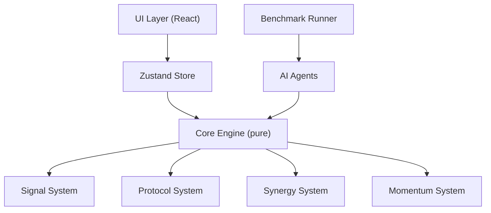
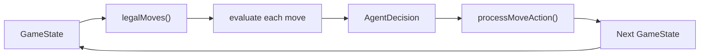
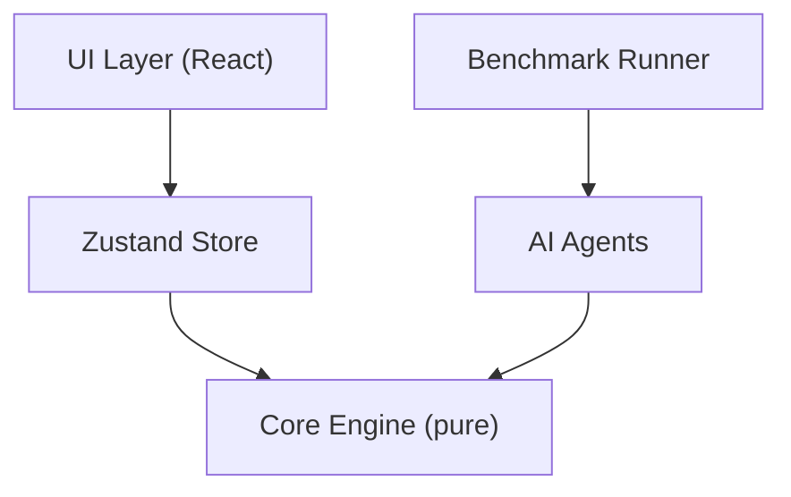

# Merge Catalyst — AI Agent Guide

## Agent Interface

All agents implement the `Agent` interface from `src/ai/types.ts`:

```ts
interface Agent {
  readonly name:   string;
  readonly config: Record<string, unknown>;

  nextAction(state: GameState): AgentAction;
  explain?(state: GameState): AgentEvaluation;
}
```

`nextAction` is the only required method. It receives the current `GameState` and returns a `Direction` (`'up' | 'down' | 'left' | 'right'`).

`explain` is optional — it returns the top candidate moves with scores and a reasoning string. Useful for debugging and documentation.

---

## Supporting Types

```ts
type AgentAction = 'up' | 'down' | 'left' | 'right';

interface CandidateMove {
  action:      AgentAction;
  score:       number;
  description?: string;
}

interface AgentDecision {
  action:       AgentAction;
  candidates?:  CandidateMove[];
  explanation?: string;
}

interface AgentEvaluation {
  topCandidates: CandidateMove[];
  chosen:        AgentAction;
  reasoning:     string;
}
```

---

## Implemented Agents

> Benchmark policy note: default balance/tuning suites now run **HeuristicAgent**
> as the main practical benchmark strategy. Other agents are retained for smoke
> and debug suites, plus future AI extension work.

### RandomAgent (`src/ai/agents/randomAgent.ts`)

```ts
new RandomAgent(seed?)
```

Picks a uniform random legal move. Uses the seeded PRNG so runs are deterministic.

**Use as**: lower-bound baseline.

---

### GreedyAgent (`src/ai/agents/greedyAgent.ts`)

```ts
new GreedyAgent()
```

Evaluates all legal moves with `scoreImmediateMove()` and picks the best.

Immediate score = `outputGained × 5 + emptyCells × 20 + maxTileGrowth × 10 + cornerBonus × 2`

**Use as**: fast single-depth baseline.

---

### HeuristicAgent (`src/ai/agents/heuristicAgent.ts`)

```ts
new HeuristicAgent({ weights?: Partial<EvalWeights> })
```

Evaluates resulting state after each move using a weighted multi-factor function:

| Factor | Default Weight | Description |
|--------|---------------|-------------|
| `empty` | 270 | Empty cells after move |
| `monotonicity` | 47 | How sorted the grid is |
| `smoothness` | 100 | Penalise large adjacent differences |
| `corner` | 30 | Max tile in corner bonus |
| `merge` | 700 | Adjacent equal-value pairs |
| `maxTile` | 1 | Log2 of max tile |
| `anomaly` | -200 | Anomaly risk penalty |
| `output` | 10 | Current phase output |

Weights are configurable at construction time.

---

### BeamSearchAgent (`src/ai/agents/beamSearchAgent.ts`)

```ts
new BeamSearchAgent({ depth?: number, beamWidth?: number, weights?: Partial<EvalWeights> })
```

Performs beam search to `depth` levels, keeping top-`beamWidth` states at each level.
Returns the first move from the best final state.

Default: `depth=3, beamWidth=3`.

---

### MCTSAgent (`src/ai/agents/mctsAgent.ts`)

```ts
new MCTSAgent({ rollouts?: number, rolloutDepth?: number, seed?: number })
```

For each legal move, performs `rollouts` random simulations to depth `rolloutDepth`.
Returns the action with the highest mean evaluation score.

Default: `rollouts=20, rolloutDepth=10`.

---

## Policy Helpers

### `src/ai/policy/features.ts`

| Function | Returns | Description |
|----------|---------|-------------|
| `countEmptyCells(grid)` | number | Empty cell count |
| `maxTile(grid)` | number | Highest tile value |
| `monotonicity(grid)` | number | Grid monotonicity score |
| `smoothness(grid)` | number | Penalises adjacent differences |
| `cornerStability(grid)` | number | log2(maxTile) if in corner |
| `mergePotential(grid)` | number | Adjacent equal-tile pairs |
| `anomalyRisk(state)` | 0–1 | Risk factor based on active anomaly |
| `catalystSynergyBonus(state, ...)` | number | Bonus for catalyst-aligned moves |

### `src/ai/policy/evaluation.ts`

`evaluateState(state, weights?)` — single-function weighted evaluation of a `GameState`.

### `src/ai/policy/scoring.ts`

`scoreImmediateMove(state, dir)` — immediate score for a single move direction.  
`legalMoves(state)` — returns all directions that change the grid.

---

## Agent Interaction with New Systems

### Signals

The benchmark runner (`src/benchmark/runner.ts`) **ignores signals** by default (simple strategy: never use signals). This provides a clean baseline.

To add signal strategy in an agent:
- Inspect `state.signals` before selecting a move
- Call `queueSignal(state, signalId)` before `processMoveAction`
- Recommended strategies:
  - `pulse_boost`: queue when current move would produce high output (chain ≥ 3)
  - `grid_clean`: queue when board is crowded (empty cells < 3)
  - `freeze_step`: queue when a bad spawn would block a critical merge
  - `chain_trigger`: queue when chain length ≥ 3 in current position

```ts
// Example: simple pulse_boost strategy
if (state.signals.includes('pulse_boost') && expectedChain >= 3) {
  stateBeforeMove = queueSignal(state, 'pulse_boost');
}
```

### Protocols

The benchmark runner creates games with the default protocol (`corner_protocol`). To test different protocols:

```ts
const state = createInitialState(seed, 'sparse_protocol');
```

Each protocol changes:
- `corner_protocol`: boost corner move evaluation weight
- `sparse_protocol`: early game strategy changes (fewer tiles → more careful play)
- `overload_protocol`: prioritise efficiency (fewer steps, higher output scale)

Agents should ideally weight `corner` factor higher under `corner_protocol`.

### Synergy Awareness

The `HeuristicAgent` and `BeamSearchAgent` can benefit from synergy awareness. Knowing that `corner_crown + empty_amplifier` is a strong combo, agents should:
1. Prefer acquiring the second catalyst in an active synergy pair
2. Weight corner merges more if `corner_empire` synergy is active
3. Weight empty cells more if `empty_amplifier` is in play

Future heuristic enhancement: add `synergyPotential` as an evaluation factor.

---

## Future RL Integration Plan

The `Agent` interface is already RL-ready. The `PolicyAgent` adapter in `src/ai/types.ts` wraps any `Policy` as an agent:

```ts
class PolicyAgent implements Agent {
  constructor(private policy: Policy) {}
  nextAction(state: GameState): AgentAction {
    return this.policy.selectAction(state);
  }
}
```

### Observation Space Extensions

With new systems, the observation vector should include:
- Grid log2 values (16 cells)
- Phase index, steps/target ratio
- Catalyst flags (24 bits)
- Synergy flags (5 bits)
- Momentum multiplier (float)
- Signal inventory (4 bits)
- Protocol index (3 bits)
- Anomaly phase flag

### Reward Shaping Ideas

- Per-move reward: `finalOutput × momentumMultiplier`
- Phase clear bonus: `+50`
- Synergy activation bonus: `+10 per synergy trigger`
- Signal efficiency: `reward × 1.5` when signal was used and output was above average

---

## Diagrams

### Architecture



### Agent Evaluation Pipeline




## Agent Interface

All agents implement the `Agent` interface from `src/ai/types.ts`:

```ts
interface Agent {
  readonly name:   string;
  readonly config: Record<string, unknown>;

  nextAction(state: GameState): AgentAction;
  explain?(state: GameState): AgentEvaluation;
}
```

`nextAction` is the only required method. It receives the current `GameState` and returns a `Direction` (`'up' | 'down' | 'left' | 'right'`).

`explain` is optional — it returns the top candidate moves with scores and a reasoning string. Useful for debugging and documentation.

---

## Supporting Types

```ts
type AgentAction = 'up' | 'down' | 'left' | 'right';

interface CandidateMove {
  action:      AgentAction;
  score:       number;
  description?: string;
}

interface AgentDecision {
  action:       AgentAction;
  candidates?:  CandidateMove[];
  explanation?: string;
}

interface AgentEvaluation {
  topCandidates: CandidateMove[];
  chosen:        AgentAction;
  reasoning:     string;
}
```

---

## Implemented Agents

### RandomAgent (`src/ai/agents/randomAgent.ts`)

```ts
new RandomAgent(seed?)
```

Picks a uniform random legal move. Uses the seeded PRNG so runs are deterministic.

**Use as**: lower-bound baseline.

---

### GreedyAgent (`src/ai/agents/greedyAgent.ts`)

```ts
new GreedyAgent()
```

Evaluates all legal moves with `scoreImmediateMove()` and picks the best.

Immediate score = `outputGained × 5 + emptyCells × 20 + maxTileGrowth × 10 + cornerBonus × 2`

**Use as**: fast single-depth baseline.

---

### HeuristicAgent (`src/ai/agents/heuristicAgent.ts`)

```ts
new HeuristicAgent({ weights?: Partial<EvalWeights> })
```

Evaluates resulting state after each move using a weighted multi-factor function:

| Factor | Default Weight | Description |
|--------|---------------|-------------|
| `empty` | 270 | Empty cells after move |
| `monotonicity` | 47 | How sorted the grid is |
| `smoothness` | 100 | Penalise large adjacent differences |
| `corner` | 30 | Max tile in corner bonus |
| `merge` | 700 | Adjacent equal-value pairs |
| `maxTile` | 1 | Log2 of max tile |
| `anomaly` | -200 | Anomaly risk penalty |
| `output` | 10 | Current phase output |

Weights are configurable at construction time.

---

### BeamSearchAgent (`src/ai/agents/beamSearchAgent.ts`)

```ts
new BeamSearchAgent({ depth?: number, beamWidth?: number, weights?: Partial<EvalWeights> })
```

Performs beam search to `depth` levels, keeping top-`beamWidth` states at each level.
Returns the first move from the best final state.

Default: `depth=3, beamWidth=3`.

---

### MCTSAgent (`src/ai/agents/mctsAgent.ts`)

```ts
new MCTSAgent({ rollouts?: number, rolloutDepth?: number, seed?: number })
```

For each legal move, performs `rollouts` random simulations to depth `rolloutDepth`.
Returns the action with the highest mean evaluation score.

Default: `rollouts=20, rolloutDepth=10`.

---

## Policy Helpers

### `src/ai/policy/features.ts`

| Function | Returns | Description |
|----------|---------|-------------|
| `countEmptyCells(grid)` | number | Empty cell count |
| `maxTile(grid)` | number | Highest tile value |
| `monotonicity(grid)` | number | Grid monotonicity score |
| `smoothness(grid)` | number | Penalises adjacent differences |
| `cornerStability(grid)` | number | log2(maxTile) if in corner |
| `mergePotential(grid)` | number | Adjacent equal-tile pairs |
| `anomalyRisk(state)` | 0–1 | Risk factor based on active anomaly |
| `catalystSynergyBonus(state, ...)` | number | Bonus for catalyst-aligned moves |

### `src/ai/policy/evaluation.ts`

`evaluateState(state, weights?)` — single-function weighted evaluation of a `GameState`.

### `src/ai/policy/scoring.ts`

`scoreImmediateMove(state, dir)` — immediate score for a single move direction.  
`legalMoves(state)` — returns all directions that change the grid.

---

## Future RL Integration Plan

The `Agent` interface is already RL-ready. The `PolicyAgent` adapter in `src/ai/types.ts` wraps any `Policy` as an agent:

```ts
class PolicyAgent implements Agent {
  constructor(private policy: Policy) {}
  nextAction(state: GameState): AgentAction {
    return this.policy.selectAction(state);
  }
}
```

### Interfaces for future training

```ts
interface DQNPolicy extends Policy {
  readonly kind: 'dqn';
  loadWeights(checkpoint: unknown): void;
}

interface PPOPolicy extends Policy {
  readonly kind: 'ppo';
  loadWeights(checkpoint: unknown): void;
}
```

### Roadmap

1. **Observation space**: encode `GameState` as a flat vector (grid log2 values, phase index, steps/target ratio, catalyst flags, anomaly phase flag)
2. **Action space**: 4 discrete actions (up/down/left/right)
3. **Reward**: `finalOutput` at episode end (or per-move delta)
4. **Replay buffer**: `src/ai/policy/replayBuffer.ts` (to be created)
5. **Training loop**: `src/scripts/trainDQN.ts` (to be created)
6. **Evaluation**: run trained policy through `npm run benchmark` using `PolicyAgent`

### Replay / Export Ideas

- Export `reactionLog` from runs as a JSON training dataset
- Use `RunMetrics` as episode metadata
- Filter by "won" runs for imitation learning

The benchmark runner already produces `runs.csv` which can serve as an early supervised learning corpus.

---

## Diagrams

### Architecture



### Agent Evaluation Pipeline


---

## How Unlocks Affect Agent Performance

### Catalyst Pool Restriction

When `unlockedCatalysts` is set in `GameState` (or via `RunOptions`), the Forge and Infusion screens only offer catalysts from the restricted pool.  
Agents **do not need any changes** — they evaluate whatever options are presented; the pool restriction is transparent to agent logic.

- In **full pool** mode (`unlockedCatalysts: undefined`), all 24 catalysts are available.
- In **restricted pool** mode (`unlockedCatalysts: BASE_UNLOCKED_CATALYSTS`), only the 8 legacy catalysts appear.

Empirically, the full pool increases HeuristicAgent win rate by ~20–30 percentage points due to:
- More synergy combinations
- Access to specialist Amplifier / Stabilizer / Generator catalysts
- Higher ceiling for catalyst-stack strategies

### Ascension Level Effects

Higher Ascension levels make the run harder (fewer steps, higher phase targets, etc.).  
Agents experience this as a tighter decision space:
- Fewer moves available per phase → less room for recovery
- Higher phase targets → must produce output on almost every move
- Reduced Forge affordability → fewer catalyst acquisitions

Agents with lookahead (BeamSearchAgent, MCTSAgent) generally tolerate ascension pressure better than greedy agents because they can plan ahead when the step budget is tight.

### Benchmark Guidance for Agents

To evaluate an agent across the full meta-progression difficulty range:

```ts
import { runAscensionSuite } from './src/benchmark/suites';
import { HeuristicAgent } from './src/ai/agents';

const result = runAscensionSuite(
  [new HeuristicAgent()],
  50,      // runs per level
  5000,    // seed start
);

// result.metricsByLevel[0]['HeuristicAgent'].winRate → A0 win rate
// result.metricsByLevel[8]['HeuristicAgent'].winRate → A8 win rate
```

To compare base vs full unlock pool performance:

```ts
import { runUnlockComparisonSuite } from './src/benchmark/suites';

const cmp = runUnlockComparisonSuite([new HeuristicAgent()], 50, 6000);
console.log(cmp.baseMetrics['HeuristicAgent'].winRate);
console.log(cmp.fullMetrics['HeuristicAgent'].winRate);
```
