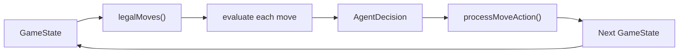
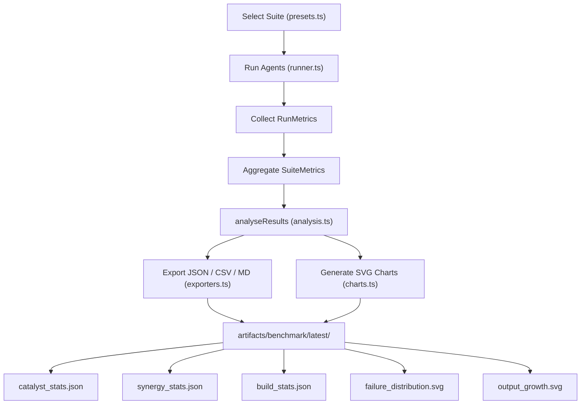

# Merge Boost — Benchmark Guide

## Goals

The benchmark framework lets you:
- Tune pacing, economy, and board growth with a stable high-performing strategy
- Identify which stages or levels are too hard or too easy
- Detect overpowered or underpowered Boosts and Combos
- Track score-chasing progression and build growth across levels
- Measure pacing (moves per stage), late-game pressure, and survival depth
- Produce reproducible, comparable numbers across code changes

Default balance suites are now **Heuristic-first**; multi-agent comparison is optional debug-only.

> **Theme note**: The UI presentation layer (tile labels, colours, display score
> scaling) has **no effect on benchmark results**.  All benchmark metrics —
> `finalOutput`, `meanOutput`, `avgRoundsCleared`, etc. — are raw internal numeric
> values.  `DISPLAY_SCORE_SCALE` is a UI-only multiplier and is never applied to
> benchmark output.  Benchmark results remain directly comparable across all
> theme changes.

---

## Game Architecture: Endless Levels

The standard game is an **endless-level roguelike loop**:

- Every **6 stages** form one **level**
- After completing a level the game continues into Level N+1 (no fixed win state)
- The game ends when a stage target is not met within the step limit → `game_over`
- Levels scale in difficulty automatically via compound target scaling

The benchmark **does not** measure "win rate" for the standard mode.  Instead it
measures **levels cleared**, **output growth**, **failure depth**, and **pacing**.
Win rate only applies to finite challenge / legacy modes with an explicit win condition.

---

## Agent Overview

| Agent | Strategy | Notes |
|-------|----------|-------|
| RandomAgent | Uniform random from legal moves | Baseline lower bound |
| GreedyAgent | Best immediate heuristic (output, empty, corner) | Fast, no lookahead |
| HeuristicAgent | Weighted multi-factor evaluation (empty/mono/smooth/corner/merge/hazard) | Configurable weights |
| BeamSearchAgent | Beam search, configurable depth and width | Lookahead without full tree |
| MCTSAgent | Monte Carlo Tree Search with random rollouts | Best-effort quality |

All agents implement the `Agent` interface from `src/ai/types.ts`.

---

## Agent Evaluation Pipeline



---

## Metrics Explained

### Per-Run Metrics (`RunMetrics`)

#### Primary Depth Metrics

| Metric | Description |
|--------|-------------|
| `roundsCleared` | Complete levels finished in this run |
| `highestRound` | Highest level number reached (= roundsCleared + 1 if failed mid-level) |
| `failureRound` | Level number where the run ended with `game_over` (undefined if truncated at maxRounds) |
| `failurePhaseIndex` | Stage index (0–5) within the failure level (undefined if not failed) |
| `phasesCleared` | Total stages cleared across all levels |
| `finalOutput` | Total Output accumulated across all stages |

#### Pacing & Board Metrics

| Metric | Description |
|--------|-------------|
| `avgOutputPerMove` | finalOutput / totalSteps |
| `avgMovesPerPhase` | Average moves spent per completed stage |
| `maxTile` | Highest tile value reached |
| `uniqueCatalystsAcquired` | Number of distinct boost IDs acquired |
| `anomalySurvivalRate` | Fraction of hazard stages survived (0–1) |
| `avgMergesPerMove` | Average merges per step |
| `avgEmptyCells` | Average empty cells across all steps |
| `moveDiversity` | Normalised entropy of action distribution (0=one direction, 1=uniform) |

#### Per-Stage Granular Records (`phaseHistory`)

Each cleared or failed stage is recorded as a `PhaseRecord`:

| Field | Description |
|-------|-------------|
| `round` | Level number |
| `phaseIndex` | Stage index within the level (0–5) |
| `movesUsed` | Steps spent in this stage |
| `targetOutput` | Effective target (including build-aware factor) |
| `actualOutput` | Output achieved |
| `maxTile` | Highest board tile when the stage ended |
| `cleared` | Whether the stage was successfully cleared |

#### Meta Progression

| Metric | Description |
|--------|-------------|
| `ascensionLevel` | Ascension level used for this run |
| `coreShards` | Meta currency earned this run |
| `totalCatalysts` | How many boosts were held at the end |
| `catalystReplacements` | How many times a boost was replaced |
| `totalEnergyEarned` | Proxy for energy economy |
| `forgeOfferRarityCounts` | Per-run Shop offer distribution by rarity |
| `acquiredRarityCounts` | Per-run Boost acquisition distribution by rarity |
| `firstRareRound` | Level of first Rare acquisition (if any) |
| `firstEpicRound` | Level of first Epic acquisition (if any) |
| `selectedPattern` | Style archetype active at run end |

---

### Aggregate Suite Metrics (`SuiteMetrics`)

#### Primary Endless-Mode Metrics

| Metric | Description |
|--------|-------------|
| `avgRoundsCleared` | Mean complete levels cleared per run |
| `medianRoundsCleared` | Median complete levels cleared per run |
| `p90RoundsCleared` | 90th-percentile complete levels cleared |
| `meanHighestRound` | Mean highest level number reached |
| `maxRoundReached` | Highest level number reached across all runs |
| `outputGrowthByRound` | Mean finalOutput of runs that reached each level |
| `failureDistributionByRound` | Count of runs ending in each level (where difficulty wall is) |
| `failureDistributionByPhaseIndex` | Count of failures by stage index (0–5) |

#### Output Metrics

| Metric | Description |
|--------|-------------|
| `meanOutput` | Mean `finalOutput` across all runs |
| `medianOutput` | Median `finalOutput` |
| `p90Output` | 90th-percentile `finalOutput` |
| `scoreVariance` | Variance of `finalOutput` |
| `scoreStdDev` | Standard deviation |
| `avgOutputPerMove` | Mean output efficiency |

#### Pacing Metrics

| Metric | Description |
|--------|-------------|
| `avgMovesPerPhase` | Mean moves per completed stage |
| `avgMovesPerPhaseByRound` | Moves per stage broken down by level number |
| `lateGameClearTurns` | Avg moves to clear stages in level 4+ |
| `shortClearRate` | Fraction of cleared stages completed in ≤3 moves |
| `lateGameShortClearRate` | Same, restricted to level 4+ |
| `avgMaxTile` | Average of each run's maxTile value |
| `avgHighestTierPerPhase` | Mean log2(maxTile) across cleared stages |
| `avgHighestTierPerRound` | Mean highest tier grouped by level |
| `highTierReachDistribution` | Distribution of highest tiers reached per run |
| `energyIncomePerRound` | Mean positive energy change per level |
| `energySpentPerRound` | Mean energy spent per level |
| `forgeAffordabilityRate` | Affordable Shop offers / total offers |
| `buildMaturityByRound` | Mean active boost count per level |
| `lateGameClearSpeed` | Late-game moves per stage alias for pacing checks |

#### Other

| Metric | Description |
|--------|-------------|
| `avgStepsSurvived` | Mean total steps |
| `avgCatalystCount` | Mean boosts held |
| `anomalySuccessRate` | Mean hazard survival rate |
| `maxTileDistribution` | Histogram of max tile values |
| `phaseClearDist` | Histogram of total stages cleared |
| `avgUniqueCatalysts` | Mean distinct boost IDs acquired per run |
| `offerDistributionByRarity` | Suite-level Shop rarity distribution |
| `acquisitionDistributionByRarity` | Suite-level acquisition rarity distribution |
| `avgFirstRareRound` | Mean level of first Rare acquisition |
| `avgFirstEpicRound` | Mean level of first Epic acquisition |
| `patternOutcomeByPattern` | Runs + avgRoundsCleared by style archetype |

---

### Boost Metrics (`catalyst_stats.json`)

| Field | Description |
|-------|-------------|
| `pickRate` | Fraction of runs where this boost was held at end |
| `avgRoundsCleared` | Average levels cleared in runs that held this boost |
| `meanOutput` | Average final output when boost was held |
| `avgOutputContribution` | Average output-per-move when boost was held |

### Combo Metrics (`synergy_stats.json`)

| Field | Description |
|-------|-------------|
| `triggerRate` | Fraction of runs that had both combo boosts active |
| `avgRoundsCleared` | Avg levels cleared when this combo was active |
| `meanOutput` | Average final output when combo was active |

### Build Metrics (`build_stats.json`)

Top 10 most common boost combinations, sorted by frequency.

| Field | Description |
|-------|-------------|
| `catalysts` | List of boost IDs in the build |
| `frequency` | Fraction of runs with this exact combo |
| `avgRoundsCleared` | Average levels cleared with this build |
| `meanOutput` | Average final output for this build |

### Highlighting Dominant / Weak Builds

The analysis engine flags:
- **OP boost**: pick rate > 10% AND avgRoundsCleared > 1.5× global
- **Weak boost**: pick rate < 5% (in run count > 20)
- **OP combo**: trigger rate > 5% AND avgRoundsCleared > 2× global

---

## Suite Definitions

| Suite | Agents | Runs/Agent | Purpose |
|-------|--------|-----------|---------|
| `smoke` | All 5 | 5 | Quick sanity — verify runs complete and artifacts generate |
| `baseline` | Heuristic | 40 | Default tuning baseline for pacing/economy/board growth |
| `long` | Heuristic | 120 | Higher-confidence Heuristic tuning validation |
| `balance` | Heuristic | 35 | Economy tightness + boost/build maturity probe |
| `pacing` | Heuristic | 30 | Moves per stage, late-game clear speed, tier growth |
| `round_stress` | Heuristic | 30 | Later-level failure styles and pressure checks |
| `debug_agents` | All 5 | 20 | Optional debug comparison (not in default tuning flow) |

---

## Generated Charts

| File | Description |
|------|-------------|
| `rounds_cleared.svg` | Avg levels cleared by agent |
| `output_distribution.svg` | Mean final output by agent |
| `phase_clear.svg` | Avg stages cleared by agent |
| `max_tile.svg` | Avg max tile by agent |
| `output_growth.svg` | Output growth by level (first agent) |
| `failure_distribution.svg` | Failure count by level number (all agents) |

---

## Benchmark Workflow



---

## Using Run Log Exports in Benchmark/Tuning Workflow

Gameplay exports now use structured bundle schema `run-log-export.v1` and can be fed into
manual or scripted review loops:

- End Screen export (`JSON`/`CSV`) for current run
- Debug Start Screen export (`?debug=export_logs`) for all local runs + summary CSV

Bundle contents include schema/config version, run metadata, build snapshot, step-level records,
derived pacing/energy metrics, replay actions, and resolved config snapshot.

Use the helper script for quick summaries and before-vs-after comparisons:

```bash
npm run runlog:analyze -- artifacts/runlog_before.json artifacts/runlog_after.json
```

This prints per-file summary metrics and aligned run deltas (`finalOutputDelta`, `roundsReachedDelta`,
`avgOutputPerMoveDelta`) to make balance regressions easier to spot.

### Generating Human-Readable Reports

Use `report:run` and `report:compare` to produce Markdown + HTML reports for local review:

```bash
# Single-run analysis report
npm run report:run -- artifacts/my_run.json my_run_report.md

# Before-vs-after comparison (2 bundles → diff report with config diff)
npm run report:compare -- artifacts/before.json artifacts/after.json diff_report.md

# Multi-run comparison table (3+ bundles)
npm run report:compare -- artifacts/run_a.json artifacts/run_b.json artifacts/run_c.json summary.md
```

Reports include pacing health, economy balance, highest-tier trends, and actionable interpretation.

---

## How to Run

```bash
npm run benchmark             # baseline suite (Heuristic-focused)
npm run benchmark:long        # long suite (Heuristic-focused)
npm run balance               # balance + pacing + round_stress suites
npm run balance:tune          # iterative Heuristic auto-tuning loop
npx tsx src/scripts/runBenchmark.ts --suite smoke
npx tsx src/scripts/runBenchmark.ts --suite round_stress
npx tsx src/scripts/runBenchmark.ts --suite debug_agents
```

---

`npm run sync:config` runs automatically before benchmark scripts. Numeric tuning
inputs come from `config/game.yaml` (validated and synced to generated runtime config).

`npm run balance:tune` writes:
- `tuning_history.json`
- `best_config.json`
- `best_config.yaml`
- `tuning_summary.md`
- `before_vs_after.md`

## How to Interpret Results

| Observation | Interpretation |
|-------------|---------------|
| `avgRoundsCleared < 1` for HeuristicAgent | Game too hard — reduce early stage targets |
| `avgRoundsCleared > 8` for MCTS | Game too easy — increase targets or reduce steps |
| All agents clear same number of levels | Game lacks strategic depth |
| `lateGameShortClearRate > 10%` | Build power is outpacing target curve in late levels |
| `failureDistributionByRound` spikes at Level 1 | Early game is the difficulty wall |
| `failureDistributionByRound` spikes at Level 3–4 | Mid-game scaling is the difficulty wall |
| Hazard survival < 30% | Entropy Tax / Collapse Field too punishing |
| Boost pick rate < 5% | Boost too expensive or too weak |
| Boost `avgRoundsCleared` >> global | Boost potentially overpowered |
| Combo `avgRoundsCleared` >> global | Combo potentially overpowered |
| High score variance | Game is swingy (possibly by design) |
| Dominant build > 30% of runs | Build diversity too low |

---

## What "Good Benchmark Results" Look Like

- **Agent distinction**: HeuristicAgent and MCTS clearly outperform RandomAgent
- **Levels cleared**: best agent averages 2–5 levels cleared
- **Failure distribution**: most failures in levels 2–4 (not level 1 or very late)
- **Pacing**: `avgMovesPerPhase` 6–12 across all levels; no level averages < 4
- **Late-game**: `lateGameShortClearRate` < 10%; stages don't trivially clear in 1–2 moves
- **Hazard challenge**: hazard stages cause a measurable survival drop
- **Boost usage**: at least 3–5 boosts see > 10% pick rate
- **Combo spread**: no single combo accounts for > 50% of deep runs
- **Build diversity**: top build frequency < 30%
- **Output growth**: `outputGrowthByRound` increases meaningfully each level
- **Reproducibility**: running the same suite twice gives < 5% difference in `avgRoundsCleared`

---

## Meta Progression Benchmarks

The `benchmark:meta` script (`src/scripts/runMetaBenchmark.ts`) adds three analysis modes.

### 1. Ascension Level Sweep (`--mode ascension`)

Runs the same agents across all 9 Ascension levels (0–8) and reports per-level levels cleared.

```
npm run benchmark:meta -- --mode ascension
```

#### Expected output

```
Level | Description                    | AvgRounds (Heuristic) | AvgRounds (MCTS)
A0    | No modifiers — baseline        |                  3.50 |             5.20
A1    | -1 Step per Phase              |                  1.20 |             2.50
A2    | +15% target output             |                  0.80 |             1.50
...
A8    | Combined penalties             |                  0.00 |             0.10
```

A healthy difficulty curve shows a steady drop in levels cleared across levels.

---

### 2. Unlock Pool Comparison (`--mode unlock`)

Compares agent performance with:
- **Base pool** — only the 8 legacy boosts (fresh profile restriction)
- **Full pool** — all 24 boosts (no unlock restrictions)

```
npm run benchmark:meta -- --mode unlock
```

#### What to look for

| Pool | Expected HeuristicAgent AvgRounds |
|------|-----------------------------------|
| Base (8 legacy only) | 1.5–3.0 |
| Full (all 24) | 3.0–5.0 |

A gap of ~1.5–2 levels validates that unlocks provide real progression power.
If the gap is < 0.5, the advanced boosts may be too weak.
If > 4, the base experience may be too punishing for new players.

---

### 3. Meta Progression Simulation (`--mode simulate`)

Simulates a player playing 20 runs in sequence, earning Core Shards each run.

```
npm run benchmark:meta -- --mode simulate
```

#### Sample output

```
Run | Shards | Total | Phases | Rounds
  1 |     20 |    20 |      4 |      0
  4 |     53 |   143 |      6 |      1
 11 |     53 |   306 |      6 |      1
```

---

## RunOptions Fields

| Field | Type | Default | Description |
|-------|------|---------|-------------|
| `ascensionLevel` | `0–8` | `0` | Ascension level for the run |
| `protocol` | `ProtocolId` | `corner_protocol` | Rule to use |
| `maxRounds` | `number` | `10` | Maximum levels to simulate (caps endless runs for benchmark) |
| `unlockedCatalysts` | `CatalystId[] \| undefined` | `undefined` (full pool) | Restricts Shop boost pool |

---

## Stage Pacing Benchmark (v6)

### PhaseRecord Tracking

Every cleared (and failed) stage is recorded with:

| Field | Description |
|-------|-------------|
| `round` | Level number |
| `phaseIndex` | Stage index within the level (0–5) |
| `movesUsed` | Steps spent in this stage |
| `targetOutput` | Effective target (including build-aware factor) |
| `actualOutput` | Output achieved |
| `maxTile` | Highest board tile when the stage ended |
| `cleared` | Whether the stage was successfully cleared |

### v6 Benchmark Targets (HeuristicAgent, Ascension 0, 50 runs)

| Metric | Expected Range |
|--------|---------------|
| Avg moves per stage | 6–12 |
| Short-clear rate | < 10 % |
| Late-game short-clear rate (level 4+) | < 5 % |
| Avg levels cleared (median) | 2–4 |

### Detecting Regressions

- **Short-clear rate above 10 %**: build power is outpacing target curve
  → increase `BUILD_AWARE_SCALING.catalystWeight` or `multiplierWeight`
- **Late-game short-clear rate above 5 %**: compound scaling insufficient for high levels
  → increase `ROUND_TARGET_SCALE` or reduce `maxFactor`
- **avgRoundsCleared drops below 1** for HeuristicAgent: early-game overtightened
  → reduce base targets in `PHASE_CONFIG` (stage 1–3)
- **Avg moves per stage > 15**: targets are too high for typical builds
  → reduce `BUILD_AWARE_SCALING.maxFactor` or `catalystWeight`
