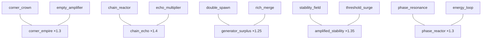
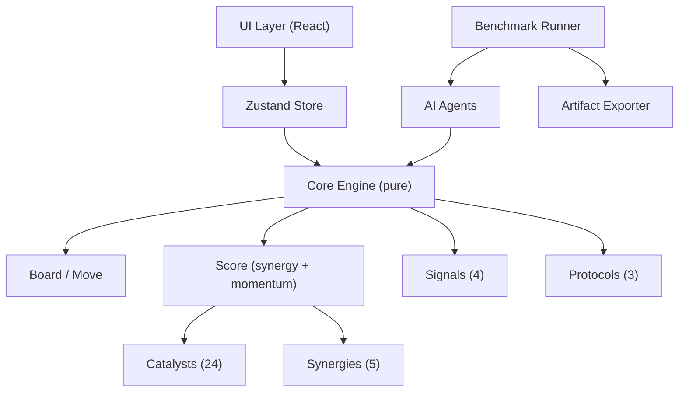
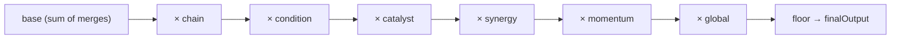
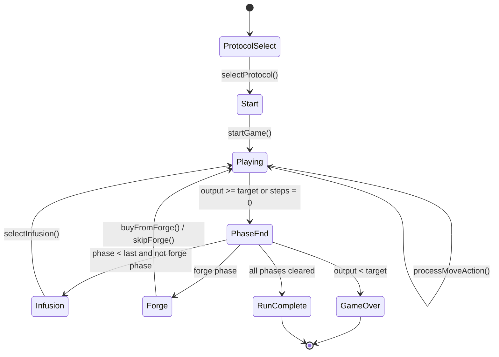
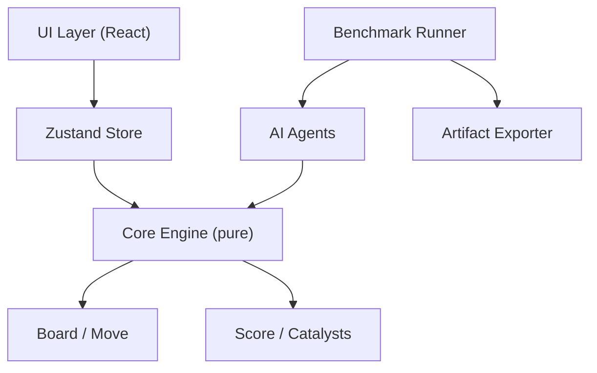
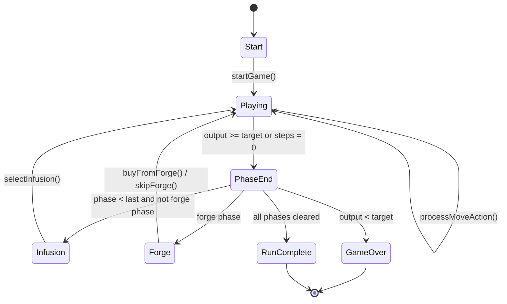
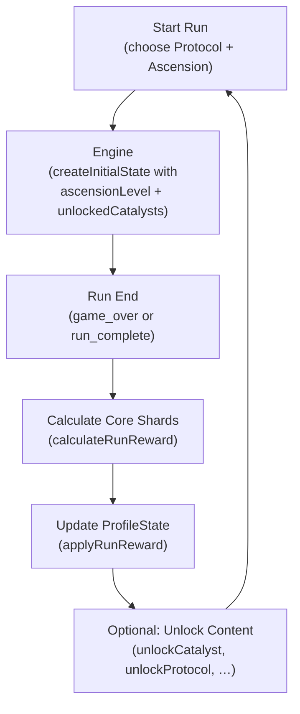
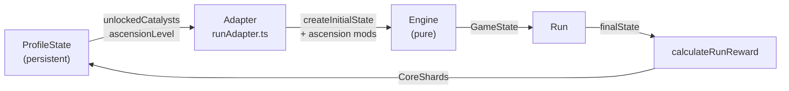
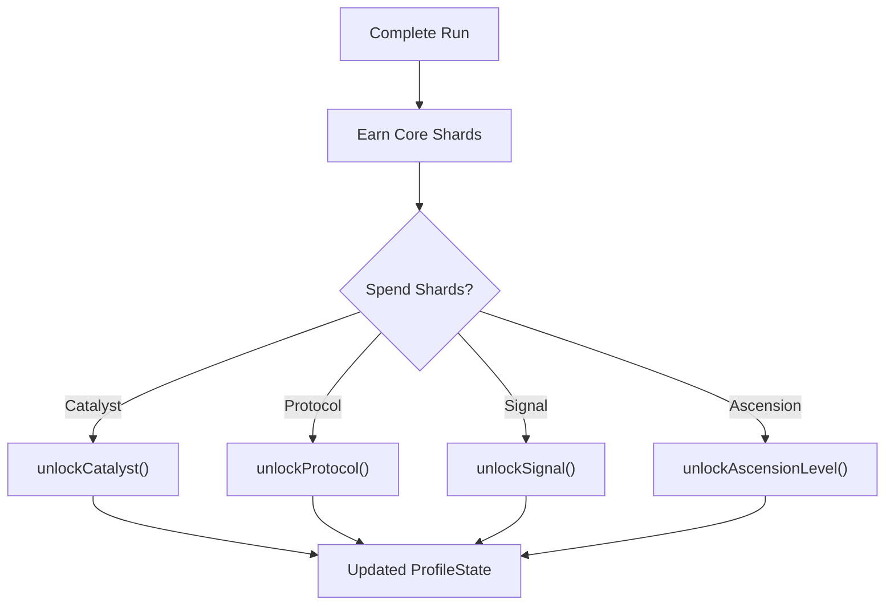

# Merge Boost — Design Document

## Overview

Merge Boost is a roguelike puzzle game built on a discrete tile-merge grid.  The player progresses through **endless levels**, each containing 6 Stages.  After every stage, the player enters an **Intermission**: first choosing a Pick reward, then optionally shopping at the Shop.  Two Hazard stages per level add asymmetric challenges.  Levels scale in difficulty — targets increase by 12% per level — so score-chasing runs grow progressively more demanding.

The player-facing tile visuals are driven by a **pluggable theme layer** — the default shell uses a generic progression ladder (Seed → Singularity) rather than raw numeric labels.  Core game logic always operates on internal power-of-two values; the theme layer is purely presentational.

It also ships a complete **benchmark-aware simulation framework** that allows AI agents to play the game headlessly, batch simulations to run for balance analysis, and results to be exported for review.

---

## Terminology

| Term | Meaning |
|------|---------|
| Boost | Power-up modifier |
| Category | Boost classification (Amplifier / Stabilizer / Generator / Modifier / Legacy) |
| Skill | One-time-use tactical ability |
| Rule | Immutable base ruleset selected at run start |
| RunStakes | Descriptor tag on a Rule expressing how demanding its ruleset is (`standard` / `tactical` / `overclocked`) |
| Stage | One stage within a level (6 stages = 1 level) |
| Level | Group of 6 stages; runs continue across levels endlessly |
| Hazard | Special challenge modifier active during certain stages |
| Shop | Shop for buying Boosts (available after every stage via Intermission) |
| Intermission | Post-stage node: Pick choice followed by Shop access |
| Pick | Post-stage reward choice |
| Energy | Currency for the Shop |
| Output | Score |
| Steps | Moves remaining |
| Grid | 4×4 play field |
| Reaction Log | Move history log |
| Combo | Bonus from holding two complementary Boosts |
| Streak | Multiplier that grows with consecutive valid moves |

---

## Core Loop

```
Select Protocol
  ↓
Start Run (Round 1)
  ↓
Phase N (Playing)
  ↓ (output ≥ target OR steps = 0)
Phase End
  ├── loss (output < target, steps = 0) → Game Over
  ├── pass (not last phase) → Infusion → Forge (skip allowed) → Phase N+1
  └── pass (last phase = phase 6) → Round Complete → Round N+1
                                              (run continues, never auto-ends)
```

The run continues indefinitely — there is **no final level**.  The run ends only when the player fails a stage (output < target when steps reach 0).

---

## Grid Rules

- 4×4 grid
- Standard 2048 merge: tiles of equal value combine into their sum
- Each tile merges only once per move
- A new tile spawns only if the move changed the grid
- Default spawn: 90% chance of 2, 10% chance of 4

---

## Level & Stage Structure

### Endless Level Model

```
Round 1 → 6 phases → Round Complete → Round 2 → 6 phases → Round Complete → …
```

- Every **6 stages** form one **level**.
- After the 6th stage passes, the player sees the **Level Complete** screen, then the run continues into the next level.
- Stage pacing is centralized and additive:
  - `steps = base + phaseScale + roundScale`
  - `target = base + phaseScale + roundScale`

### Stage Roles

| Role | Purpose |
|------|---------|
| Opener | Low target; get the board moving |
| Economy | Longer steps; build energy and boosts |
| Combo Pressure | Moderate target; chain bonuses are needed |
| Hazard Pressure | Hazard active; survive with existing build |
| Recovery / Spike | High steps or high target; push score |
| Climax | Final stage of the level; boss-tier challenge |

### Intermission (Post-Stage Flow)

After every stage clear:
1. **Shop** screen — optionally buy Boosts, Styles, Skills, or utility boosts (all priced).
2. **Shop** also allows selling Boosts, Style, and Skills for config-driven partial refunds.
3. **Playing** — next stage begins with a fresh grid.

```
Phase End (pass)
  → Forge (buy / sell / skip)
  → Playing (next phase)
```

### Acquisition Layer Roles (Current Target)

- **Shop**: unified strategic acquisition and selling layer.
- **All acquisition choices are priced** (no default free reward layer).

### Style Layer (run-long archetype growth)

Styles are a separate progression layer from Boosts and Skills.  
Style acquisition is Shop-based (priced offers).  
Only one Style is active at a time: selecting the same Style upgrades level, while selecting a different Style replaces the active Style at level 1.

Archetypes:
- `corner`
- `chain`
- `empty_space`
- `high_tier`
- `economy`
- `survival`

---

## Presentation Layer Abstraction

### Core Engine vs Player-Facing Shell

```
┌─────────────────────────────────┐
│   Core Engine (src/core/)       │
│   Internal numeric values only  │
│   2 / 4 / 8 / 16 / …           │
│   Score = raw integers          │
└────────────┬────────────────────┘
             │ internalValue
             ▼
┌─────────────────────────────────┐
│   Theme Layer (src/theme/)      │
│   TileTheme → TileThemeEntry    │
│   displayLabel / colorToken /   │
│   iconToken / rarityTag         │
└────────────┬────────────────────┘
             │ display label + colour
             ▼
┌─────────────────────────────────┐
│   UI (src/ui/)                  │
│   Tile.tsx renders theme entry  │
│   scoreDisplay.ts scales output │
└─────────────────────────────────┘
```

- **Core engine** operates exclusively on internal numeric values.  No theme imports appear in `src/core/`.
- **Theme layer** maps each `internalValue` to `displayLabel`, `colorToken`, `iconToken`, and `rarityTag`.
- **UI layer** reads the active theme from `useThemeStore` and renders the themed presentation.  An optional `showInternalValue` prop on `<Tile>` shows the raw numeric value as a small debug badge.
- **Benchmark and AI agents** are unaffected by themes — they only see raw numeric game state.

### rawOutput vs displayOutput

| Field | Meaning | Where used |
|-------|---------|-----------|
| `finalOutput` / `rawOutput` | Internal score value (unchanged) | Engine, benchmark, AI agents |
| `displayOutput` | `rawOutput × DISPLAY_SCORE_SCALE` | UI panels, end screen |

`DISPLAY_SCORE_SCALE` (default 10, authored in `config/game.yaml`) makes numbers feel more rewarding without touching game mechanics.  Benchmark reports always reference raw output.

### Theme Registry

```
src/theme/
  types.ts           — TileThemeEntry + TileTheme interfaces
  defaultTheme.ts    — Default progression theme
  progressionTheme.ts — Re-export alias
  mathTheme.ts       — Placeholder (math/science)
  historyTheme.ts    — Placeholder (history/civilisation)
  cultureTheme.ts    — Placeholder (internet culture)
  themeRegistry.ts   — THEME_REGISTRY map + useThemeStore
```

New themes can be added by:
1. Creating a new `src/theme/myTheme.ts` exporting a `TileTheme`.
2. Adding it to `THEME_REGISTRY` in `themeRegistry.ts`.
3. Calling `useThemeStore.getState().setTheme('myThemeId')` to activate it.

---

## Scoring Formula

```
finalOutput = floor(base × chain × condition × catalyst × synergy × momentum × global)
```

### Base
Sum of merged tile values in that move.

### Chain Multiplier
| Merges | Default Multiplier |
|--------|-----------|
| 1 | 1.0 |
| 2 | 1.2 |
| 3 | 1.5 |
| 4+ | 2.0 |

With **Chain Reactor** boost active, the chain multiplier scales linearly: `1.0 + (N-1) × 1.2`.

### Condition Multipliers
- Corner merge (destination is a corner cell): ×1.2
- Highest tile merge (result exceeds prior max): ×1.2
- Both conditions stack multiplicatively.

### Boost Multipliers
Applied from active Boosts (see below). Each boost triggers according to its `trigger` type and `effectParams`.

### Combo Multiplier
When two complementary Boosts are both active, a Combo bonus is applied. See Combo System section.

### Streak Multiplier
Grows with consecutive valid (scoring) moves. Resets on stage start. See Streak System section.

### Global Multiplier
Starts at 1.0. Increased by +0.1 for each Pick multiplier choice taken. Also scaled by Rule `outputScale`.

---

## Boost Categories

### Amplifier (score multipliers)
Boost Output through various scaling mechanisms.

| ID | Name | Rarity | Cost | Effect |
|----|------|--------|------|--------|
| empty_amplifier | Empty Amplifier | Common | 3 | +0.05× Output per empty cell |
| chain_reactor | Chain Reactor | Rare | 5 | Chain scales ×0.2 per extra merge |
| echo_multiplier | Echo Multiplier | Rare | 5 | Carry 20% of last move's Output |
| threshold_surge | Threshold Surge | Rare | 5 | ×1.5 if base > 30 |
| phase_resonance | Stage Resonance | Epic | 7 | +0.1× per stage index |

### Stabilizer (board control)
Help maintain a clean, controllable board state.

| ID | Name | Rarity | Cost | Effect |
|----|------|--------|------|--------|
| gravity_well | Gravity Well | Common | 3 | ×1.1 if merge at corner |
| soft_reset | Soft Reset | Rare | 5 | Remove lowest tile once per run |
| buffer_zone | Buffer Zone | Common | 3 | Row 0 blocked from spawns |
| merge_shield | Merge Shield | Epic | 7 | Absorbs stage failure every 5 moves |
| stability_field | Stability Field | Rare | 5 | ×1.2 after 3 consecutive valid moves |

### Generator (resource / spawn)
Convert actions into energy and spawn additional resources.

| ID | Name | Rarity | Cost | Effect |
|----|------|--------|------|--------|
| double_spawn | Double Spawn | Common | 3 | 25% chance to spawn 2 tiles |
| rich_merge | Rich Merge | Rare | 5 | +1 Energy per merge |
| catalyst_echo | Boost Echo | Epic | 7 | Duplicate weakest boost effect once/stage |
| energy_loop | Energy Loop | Rare | 5 | 10% of Output converts to Energy |
| reserve_bank | Reserve Bank | Common | 3 | +1 Energy per step used at stage clear |

### Modifier (rule changes)
Alter fundamental game mechanics.

| ID | Name | Rarity | Cost | Effect |
|----|------|--------|------|--------|
| diagonal_merge | Diagonal Merge | Epic | 7 | ×1.2 on every 4th move |
| split_protocol | Split Rule | Epic | 7 | Split highest tile once per stage |
| inversion_field | Inversion Field | Rare | 5 | ×1.15 Output always |
| overflow_grid | Overflow Grid | Epic | 7 | +2 virtual empty cells once per run |
| delay_spawn | Delay Spawn | Rare | 5 | Skip spawn; double next spawn |
| anomaly_sync | Hazard Sync | Epic | 7 | ×1.3 when hazard triggers |

### Legacy (original 8)
The original 8 boosts retain full compatibility.

| ID | Name | Rarity | Cost | Effect |
|----|------|--------|------|--------|
| corner_crown | Corner Crown | Rare | 5 | Corner merges ×2 Output |
| twin_burst | Twin Burst | Common | 3 | ≥2 merges ×1.5 Output |
| lucky_seed | Lucky Seed | Common | 3 | Spawn: 75% 2, 25% 4 |
| bankers_edge | Banker's Edge | Common | 3 | +2 Energy on stage clear |
| reserve | Reserve | Rare | 5 | +20 Output per unused step on clear |
| frozen_cell | Frozen Cell | Common | 3 | Cell (1,1) blocked from spawns |
| combo_wire | Combo Wire | Rare | 5 | 3 consecutive moves → ×1.3 |
| high_tribute | High Tribute | Rare | 5 | Highest tile merge → ×1.4 |

---

## Combo System

When two complementary Boosts are both active simultaneously, a **Combo** bonus multiplier is applied to Output.

### Defined Combos

| Combo ID | Boosts | Multiplier | Description |
|-----------|-----------|-----------|-------------|
| corner_empire | corner_crown + empty_amplifier | ×1.3 | Empty board space amplifies corner dominance |
| chain_echo | chain_reactor + echo_multiplier | ×1.4 | Chain length echoes into next move |
| generator_surplus | double_spawn + rich_merge | ×1.25 | Extra tiles convert directly to energy |
| amplified_stability | stability_field + threshold_surge | ×1.35 | Stable board unlocks surge multiplier |
| phase_reactor | phase_resonance + energy_loop | ×1.3 | Late-stage output feeds energy loop |

Combo bonuses stack multiplicatively if multiple combos are active.



---

## Streak System

- Each consecutive valid (scoring) move increments streak
- Streak multiplier = `min(1.0 + N × 0.05, 2.0)` where N = consecutive valid moves
- Resets to 1.0 at the start of each stage (after Pick / Shop)
- A "valid move" is any move that produces at least 1 Output

---

## Skill System

Skills are **one-time-use tactical abilities** within a run. They are consumable items stored in `RunState`.

### Skill Capacity
- Maximum 2 slots per run
- Skills are consumed on use

### Available Skills

| ID | Name | Effect |
|----|------|--------|
| pulse_boost | Pulse Boost | Current move Output ×2 |
| grid_clean | Grid Clean | Remove 2 lowest-value tiles |
| chain_trigger | Chain Trigger | Force one additional merge resolution |
| freeze_step | Freeze Step | Skip tile spawn this turn |

### Usage Flow
1. Skills are obtained via Pick rewards
2. Player queues a skill before making a move (clicks the skill button in the UI)
3. The skill activates when the next move is processed
4. Skill is removed from inventory after use
5. Effect and skill name are recorded in the `ReactionLogEntry`

---

## Rule System

Rules define the **immutable base ruleset** for a run, selected at run start and fixed throughout.

### Pre-Run Selection UI

The Start Screen shows a **Rule Selection** grid with a card for each rule.  Each card displays:
- **Icon** (emoji) — from `ProtocolDef.icon`
- **Name** — from i18n key `protocol.<id>.name`
- **Stakes badge** — from `ProtocolDef.stakes`, styled with a semantic colour
- **Description on demand** — shown via shared hover/focus/tap compact-detail popover

The stakes badge comes directly from the rule definition — there is no separate mapping in the UI component.

### Available Rules

| Icon | ID | Name | Stakes | Effect |
|---|---|---|---|---|
| 📐 | corner_protocol | Corner Rule | Standard | Corner merges gain extra ×1.5 multiplier |
| 🌑 | sparse_protocol | Sparse Rule | Tactical | Start with 1 tile; spawn freq halved; output ×1.2 |
| ⚡ | overload_protocol | Overload Rule | Overclocked | Output ×1.4 but each stage has 2 fewer steps |

### Rule Fields

Each `ProtocolDef` defines:
- `icon`: emoji displayed on the selection card
- `stakes`: `'standard' | 'tactical' | 'overclocked'` — the challenge tier label
- `cornerMultiplier`: extra corner bonus
- `startTiles`: initial tiles placed (1 or 2)
- `spawnFrequencyFactor`: >1 = less frequent spawns (implemented via chance)
- `outputScale`: global output scaling
- `stepsReduction`: steps removed from each stage

### Adding a New Rule

1. Add the `ProtocolId` literal to `src/core/types.ts`
2. Add the `ProtocolDef` (with `icon` and `stakes`) to `src/core/protocols.ts`
3. Add i18n keys `protocol.<id>.name` and `protocol.<id>.description` to `en.ts` / `zh-CN.ts`
4. The rule will appear automatically on the Start Screen

---

## Hazards

### Entropy Tax (Stage 4)
- Before each move, 1 random empty cell is blocked from receiving a spawn tile.
- The blocked cell is highlighted in the UI.

### Collapse Field (Stage 6)
- Every 4 valid moves, the highest tile on the grid is reduced by one level (value / 2).
- Counter resets per stage.

---

## Balance v3 Changes

Introduced in Balance v3 (`balanceVersion: "v3"`, see `src/core/config.ts`).

### New Systems
- 16 new Boosts across 4 categories (total: 24)
- Skill system (4 one-time abilities)
- Rule system (3 run modifiers)
- Combo system (5 boost pair bonuses)
- Streak system (consecutive move scaling)

### Score Formula Extension
Formula extended from `base × chain × condition × catalyst × global` to:
`base × chain × condition × catalyst × synergy × momentum × global`

---

## Shop (Between Stage 3 and 4)

- 3 random Boost offers shown
- Player may buy any (if affordable) or reroll
- Reroll costs 1 Energy
- If all 3 slots are full, player must choose which Boost to replace
- Player may skip the Shop entirely at no cost
- Grid resets (rule.startTiles fresh tiles) when entering Stage 4

---

## Pick (After Each Stage Clear)

Player chooses one of up to 4 options:
1. **Gain a Boost** — add a random boost not already active (if < 3 slots)
2. **Gain 3 Energy** — adds 3 to energy reserve
3. **Gain +2 Steps** — adds 2 steps to the next stage's step limit
4. **+10% Global Multiplier** — increments globalMultiplier by 0.1

---

## Reaction Log

Each valid move records:
- `step`: which step number this was
- `action`: direction (up/down/left/right)
- `gridBefore`, `gridAfter`: full grid snapshots
- `merges`: list of merge events with positions and values
- `spawn`: position of the newly spawned tile (or null)
- `anomalyEffect`: description of any hazard effect that fired
- `base`, `multipliers`, `finalOutput`: scoring breakdown
- `triggeredCatalysts`: list of boost IDs that activated
- `synergyMultiplier`: combined combo bonus for this move
- `triggeredSynergies`: list of combo IDs that activated
- `momentumMultiplier`: current streak multiplier at time of move
- `signalUsed`: skill ID consumed this move (or null)
- `signalEffect`: description of the skill's effect (or null)

The UI displays the last 10 log entries.

---

## RNG

Uses a seeded xorshift32 PRNG. Seed is derived from `Date.now()` at game start. The seed advances per move to ensure reproducibility within a run while varying across runs. Benchmark runs use fixed seeds for deterministic comparisons.

---

## Benchmark-Aware Architecture

The core engine (`src/core/`) is **pure** — no React, no browser APIs, no side effects. This allows it to be imported by Node.js benchmark scripts directly.

```
src/
  core/          Pure game logic (no browser dependencies)
    catalysts.ts    24 catalyst definitions
    signals.ts      4 signal definitions
    protocols.ts    3 protocol definitions
    synergies.ts    5 synergy definitions
    score.ts        Extended scoring (synergy + momentum)
    engine.ts       Game engine (signals, protocols, momentum)
    config.ts       All tuning constants
  ai/            Headless AI agents and policy evaluation
  benchmark/     Simulation runner, metrics, exporters, charts
  scripts/       CLI entrypoints (tsx / npm scripts)
  ui/            React UI (browser only)
  store/         Zustand store (browser only)
```

---

## Balancing Philosophy

- **Centralized config**: all tuning knobs live in `src/core/config.ts`
- **Benchmark-driven tuning**: run `npm run balance` to check levels cleared, boost stats, and pacing metrics
- **Agent distinction**: if HeuristicAgent and RandomAgent score similarly, the game lacks depth
- **Stage ramp**: each stage should feel meaningfully harder, not just step-limited
- See [balance.md](balance.md) for the full tuning guide

---

## System Architecture Diagram



## Scoring Pipeline



## Game Flow Diagram



---

## UI Components

The React UI renders the game state from the Zustand store. Key panels:

| Component | Location | Purpose |
|-----------|----------|---------|
| `Header` | Top bar | Stage, Output, Steps, Energy, Rule badge, Streak, Locale switcher |
| `PhasePanel` | Left column | Stage progress bar + Hazard info |
| `ProtocolPanel` | Left column | Active Rule compact summary + on-demand detail |
| `MomentumBar` | Left column | Visual streak multiplier meter + on-demand detail |
| `CatalystPanel` | Left column | Active Boost compact cards (name + tag) |
| `SynergyPanel` | Left column | Active Combo compact cards (name + tag) |
| `BuildIdentityPanel` | Left column | Current build label + confidence + contributor chips + explanation |
| `SignalPanel` | Left column | Available Skills compact cards + Use buttons |
| `OutputPanel` | Right column | Last move score breakdown (collapsible) |
| `GridView` | Center | 4×4 game board |
| `ControlPad` | Center | On-screen arrow controls |
| `LogPanel` | Right column | Reaction log (last 10 moves, collapsible) |
| `ForgeModal` | Overlay | Boost shop with category tags, build-direction tags, and fit-state hints |
| `InfusionModal` | Overlay | Post-stage reward choice with playstyle tags |
| `HelpOverlay` | Overlay | In-game help (systems explanation) |
| `LocaleSwitcher` | Header | Toggle EN / 中文 |

---

## Localization (i18n)

All player-facing strings are extracted to `src/i18n/`.

```
src/i18n/
  types.ts      — Locale + TranslationMap types
  en.ts         — English translations (default)
  zh-CN.ts      — Simplified Chinese translations
  index.ts      — useT() hook, createT() factory, Zustand locale store
```

Translation keys are grouped by domain:
- `ui.*` — UI labels, buttons, panel titles, screen text
- `catalyst.*` — Boost names and descriptions
- `signal.*` — Skill names and descriptions
- `protocol.*` — Rule names and descriptions
- `anomaly.*` — Hazard names and descriptions
- `synergy.*` — Combo names and descriptions
- `tag.*` — Category/playstyle tag labels
- `locale.*` — Locale switcher labels

Adding a new language: create `src/i18n/<locale>.ts`, add it to `TRANSLATIONS` in `index.ts`, extend the `Locale` union in `types.ts`.

---

## Tech Stack

- **React 18** — UI rendering
- **Vite 5** — dev server and bundler
- **TypeScript 5** — type safety
- **Zustand 4** — minimal global state management (game + locale)
- **tsx** — TypeScript runner for headless scripts


## Overview

Merge Boost is a roguelike puzzle game built on 2048-style grid mechanics. The player progresses through 6 Stages, each with an Output target and step limit. Between Stage 3 and 4, the Shop allows purchasing Boosts. After each stage, a Pick reward is offered. Two Hazard stages add asymmetric challenges.

It also ships a complete **benchmark-aware simulation framework** that allows AI agents to play the game headlessly, batch simulations to run for balance analysis, and results to be exported for review.

---

## Terminology

| Term | Meaning |
|------|---------|
| Boost | Power-up modifier |
| Stage | Game stage/level |
| Hazard | Special challenge modifier |
| Shop | Shop for buying Boosts |
| Pick | Post-stage reward |
| Energy | Currency for the Shop |
| Output | Score |
| Steps | Moves remaining |
| Grid | 4×4 play field |
| Reaction Log | Move history log |

---

## Core Loop

```
Start Run
  ↓
Phase N (Playing)
  ↓ (output ≥ target OR steps = 0)
Phase End
  ├── loss → Game Over
  ├── forge phase → Forge screen → Phase N+1
  ├── last phase won → Run Complete
  └── otherwise → Infusion → Phase N+1
```

---

## Grid Rules

- 4×4 grid
- Standard 2048 merge: tiles of equal value combine into their sum
- Each tile merges only once per move
- A new tile spawns only if the move changed the grid
- Default spawn: 90% chance of 2, 10% chance of 4

---

## Stage Structure

```
Phase 1: targetOutput=70,  steps=12
Phase 2: targetOutput=80,  steps=12
Phase 3: targetOutput=75,  steps=10
→ Forge Phase (between 3 and 4)
Phase 4: targetOutput=40,  steps=8   [Anomaly: Entropy Tax]
Phase 5: targetOutput=80,  steps=10
Phase 6: targetOutput=55,  steps=8   [Anomaly: Collapse Field]
```

All stage values are centralised in `src/core/config.ts` for easy tuning.

---

## Scoring Formula

```
finalOutput = floor(base × chain × condition × catalyst × global)
```

### Base
Sum of merged tile values in that move.

### Chain Multiplier
| Merges | Multiplier |
|--------|-----------|
| 1 | 1.0 |
| 2 | 1.2 |
| 3 | 1.5 |
| 4+ | 2.0 |

### Condition Multipliers
- Corner merge (destination is a corner cell): ×1.2
- Highest tile merge (result exceeds prior max): ×1.2
- Both conditions stack multiplicatively.

### Boost Multipliers
Applied from active Boosts (see below).

### Global Multiplier
Starts at 1.0. Increased by +0.1 for each Pick multiplier choice taken.

---

## Boosts (catalogue-scale, max 6 active)

| ID | Name | Rarity | Cost | Effect |
|----|------|--------|------|--------|
| corner_crown | Corner Crown | Rare | 5 | Corner merges × 2.0 Output |
| twin_burst | Twin Burst | Common | 3 | ≥2 merges in a move × 1.5 Output |
| lucky_seed | Lucky Seed | Common | 3 | Spawn: 75% 2, 25% 4 |
| bankers_edge | Banker's Edge | Common | 3 | +2 Energy on stage clear |
| reserve | Reserve | Rare | 5 | +20 Output per unused step on stage clear |
| frozen_cell | Frozen Cell | Common | 3 | One cell (1,1) cannot spawn tiles |
| combo_wire | Combo Wire | Rare | 5 | 3 consecutive scoring moves → × 1.3 Output |
| high_tribute | High Tribute | Rare | 5 | Highest tile merge → × 1.4 Output |

---

## Hazards

### Entropy Tax (Stage 4)
- Before each move, 1 random empty cell is blocked from receiving a spawn tile.
- The blocked cell is highlighted in the UI.

### Collapse Field (Stage 6)
- Every 4 valid moves, the highest tile on the grid is reduced by one level (value / 2).
- Counter resets per stage.

---

## Balance v2 Changes

Introduced in Balance v2 (`balanceVersion: "v2"`, see `src/core/config.ts`).

### Stage Target Reductions

All stage `targetOutput` values were significantly reduced to make the game reachable for AI agents and human players. The original targets were unreachable for all tested agents.

| Stage | Target v1 | Target v2 | Steps |
|-------|-----------|-----------|-------|
| 1 | 120 | 70 | 12 |
| 2 | 260 | 80 | 12 |
| 3 | 500 | 75 | 10 |
| 4 (Entropy Tax) | 900 | 40 | 8 |
| 5 | 1400 | 80 | 10 |
| 6 (Collapse Field) | 2200 | 55 | 8 |

### Collapse Field Period

`COLLAPSE_FIELD_PERIOD` increased from 3 → 4 (every 4 scoring moves instead of 3), reducing the intensity of the Stage 6 hazard.

### Benchmark Runner Fixes

- `autoInfusion`: now prefers a **boost** slot when under the `MAX_CATALYSTS` cap; at cap it prefers **+2 steps** → multiplier → energy (avoids wasting a slot on an unusable boost choice).
- `autoForge`: after buying the cheapest affordable boost, now always calls `skipForge()` so the screen advances to `playing` (the previous version left the runner stuck on the shop screen when no purchase was made).

### Architecture: Single Source of Truth

`src/core/phases.ts` no longer duplicates stage data. It now re-exports `PHASES` directly from `PHASE_CONFIG` in `src/core/config.ts`.

---

## Shop (Between Stage 3 and 4)

- 3 random Boost offers shown
- Player may buy any (if affordable) or reroll
- Reroll costs 1 Energy
- If all 3 slots are full, player must choose which Boost to replace
- Player may skip the Shop entirely at no cost
- Grid resets (2 fresh tiles) when entering Stage 4

---

## Pick (After Each Stage Clear)

Player chooses one of up to 4 options:
1. **Gain a Boost** — add a random boost not already active (if < 3 slots)
2. **Gain 3 Energy** — adds 3 to energy reserve
3. **Gain +2 Steps** — adds 2 steps to the next stage's step limit
4. **+10% Global Multiplier** — increments globalMultiplier by 0.1

---

## Reaction Log

Each valid move records:
- `step`: which step number this was
- `action`: direction (up/down/left/right)
- `gridBefore`, `gridAfter`: full grid snapshots
- `merges`: list of merge events with positions and values
- `spawn`: position of the newly spawned tile (or null)
- `anomalyEffect`: description of any hazard effect that fired
- `base`, `multipliers`, `finalOutput`: scoring breakdown
- `triggeredCatalysts`: list of boost IDs that activated

The UI displays the last 10 log entries.

---

## RNG

Uses a seeded xorshift32 PRNG. Seed is derived from `Date.now()` at game start. The seed advances per move to ensure reproducibility within a run while varying across runs. Benchmark runs use fixed seeds for deterministic comparisons.

---

## Benchmark-Aware Architecture

The core engine (`src/core/`) is **pure** — no React, no browser APIs, no side effects. This allows it to be imported by Node.js benchmark scripts directly.

```
src/
  core/          Pure game logic (no browser dependencies)
  ai/            Headless AI agents and policy evaluation
  benchmark/     Simulation runner, metrics, exporters, charts
  scripts/       CLI entrypoints (tsx / npm scripts)
  ui/            React UI (browser only)
  store/         Zustand store (browser only)
```

### Headless Simulation Design

`runSingle(opts)` in `src/benchmark/runner.ts`:
1. Creates a game state with a fixed seed
2. Calls `agent.nextAction(state)` each step
3. Handles pick/shop screens automatically
4. Collects `RunMetrics` at the end

`runBatch(opts)` loops `runSingle` over N seeds.

Agents only depend on `src/core/` and `src/ai/`. They import no browser code.

---

## Balancing Philosophy

- **Centralized config**: all numeric tuning knobs live in `config/game.yaml`
- **Benchmark-driven tuning**: run `npm run balance` to check levels cleared, boost stats, and pacing metrics
- **Agent distinction**: if HeuristicAgent and RandomAgent score similarly, the game lacks depth
- **Stage ramp**: each stage should feel meaningfully harder, not just step-limited
- See [balance.md](balance.md) for the full tuning guide

---

## Architecture Diagram



## Game Flow Diagram



---

## Tech Stack

- **React 18** — UI rendering
- **Vite 5** — dev server and bundler
- **TypeScript 5** — type safety
- **Zustand 4** — minimal global state management
- **tsx** — TypeScript runner for headless scripts


---

## Meta Progression System

### Overview

The meta progression layer transforms Merge Boost from a single-run prototype into a replayable, progression-based roguelike with three interlocking systems:

1. **Unlock System** — content unlocked over multiple runs
2. **Difficulty System (Ascension)** — 9 scaling difficulty tiers (0–8)
3. **Meta Currency (Core Shards)** — long-term resource used for unlocks

These systems are implemented as an **adapter layer** (`src/core/runAdapter.ts`) that wraps the pure engine. The engine itself remains stateless and pure.

---

### ProfileState

`ProfileState` is the persistent player record, kept separate from `GameState`:

```ts
interface ProfileState {
  unlockedCatalysts:     CatalystId[];
  unlockedSignals:       SignalId[];
  unlockedProtocols:     ProtocolId[];
  unlockedAnomalies:     AnomalyId[];
  unlockedAscensionLevel: AscensionLevel;
  metaCurrency:          number;          // Core Shards
}
```

The default profile (`DEFAULT_PROFILE` in `src/core/profile.ts`) unlocks only:
- The 8 legacy boosts
- `corner_protocol`
- Both hazards (always in play)

### Persistence (localStorage)

Profile progress is stored in `localStorage` under key `merge_catalyst_progress`.

**Initialization logic** (`src/store/profileStore.ts`):
```
On startup:
  if localStorage["merge_catalyst_progress"] exists
    → parse and merge with DEFAULT_PROFILE (forward-compat with new fields)
  else
    → use DEFAULT_PROFILE (8 legacy catalysts only)

?debug=unlock_all in URL
    → treat all catalysts as unlocked (dev/playtesting only)
```

This ensures:
- **First visit / incognito mode** → only starter boosts are unlocked
- **Returning visit** → progress is restored from storage
- **Corrupt data** → silently falls back to DEFAULT_PROFILE

---

### Unlock Philosophy

Unlocks are **intentional long-term gates**, not time gates.

- **Why unlock?** To give experienced players access to more powerful and varied builds.
- **What is locked by default?** All 16 advanced boosts, 2 alternative rules, all 4 skills.
- **How to unlock?** Spend Core Shards (`src/core/unlockConfig.ts`).

| Content | Cost |
|---------|------|
| Common boost | 15 Core Shards |
| Rare boost | 25 Core Shards |
| Epic boost | 40 Core Shards |
| Rule | 30 Core Shards |
| Skill | 20 Core Shards |
| Ascension level N | N × 20 Core Shards |

The Shop and Pick rewards only show boosts the player has unlocked.
Benchmark mode can bypass this restriction (`ignoreUnlocks: true`) for full-pool runs.

#### Boost Unlock Rule

A Boost is **permanently unlocked** the first time it is **acquired** in any run:

- Acquired via the **Shop** (purchased with Energy), **or**
- Acquired via **Pick** (chosen as a stage-clear reward)

This immediately updates `ProfileState.unlockedCatalysts` and persists to
`localStorage`, so the Collection view reflects the unlock without requiring a
restart.

```
Acquire Catalyst (forge or infusion)
    → useProfileStore.unlockCatalysts([id])
        → deduplicated merge with existing list
        → persistProfile() → localStorage write
```

**No duplicate entries**: `unlockCatalysts` uses `Set` merge so the same boost
id is never stored twice even if acquired multiple times across runs.

---

### Ascension Philosophy

Ascension (0–8) is Merge Boost's difficulty scaling, inspired by Slay the Spire / Balatro stakes.

- **Level 0** = baseline (identical to pre-meta-progression behaviour).
- **Levels 1–7** = each level adds one new penalty, stacking cumulatively.
- **Level 8** = combined maximum penalties.

Players unlock ascension levels with Core Shards. A fresh profile can only play Ascension 0.

| Level | Cumulative Penalty |
|-------|--------------------|
| 0 | None (baseline) |
| 1 | −1 Step per Stage |
| 2 | +1 + Stage target output ×1.15 |
| 3 | +2 + Hazards trigger more frequently |
| 4 | +3 + Shop boost cost +1 |
| 5 | +4 + Higher "4" spawn probability |
| 6 | +5 + Starting Energy ×0.8 |
| 7 | +6 + Fewer Pick reward choices |
| 8 | All penalties at maximum intensity |

All values are centralised in `src/core/ascensionModifiers.ts`.

---

### Meta Currency (Core Shards)

Core Shards are earned at the end of every run:

```
reward = base(10) + phases_cleared × 5 + anomaly_cleared × 10 + floor((output − 200) / 100)
```

Config lives in `META_CURRENCY_CONFIG` inside `src/core/unlockConfig.ts`.

---

### Run Loop Integration



---

### Progression Loop Diagram



---

### Unlock Flow Diagram



---

## Level-End Reward System

When a player clears all 6 stages of a level, they see the **Level Complete** screen before entering the next level.

### Level Complete Screen
- Displays: **level number**, **level output** (output gained this level), **cumulative total output**, **best single-move output** this run
- Shows **build summary**: active Boosts (up to 4 shown) and active Combos
- Highlights: **MVP Boost** (highest rarity equipped) and **Strongest Combo** (highest multiplier)
- Shows animated **flavor text** (e.g. "System Stabilized", "Chain Reaction Amplified") that cycles per level
- Displays the **Level Reward**: +3 Energy and +5% Global Multiplier
- Contains a pulsing **"Continue Run →"** button and a "New Run" exit button

### Level Reward (config-driven)
| Constant | Value | Effect |
|---|---|---|
| `ROUND_COMPLETE_ENERGY_BONUS` | 3 | +3 Energy granted immediately |
| `ROUND_COMPLETE_MULTIPLIER_BONUS` | 0.05 | +5% global output multiplier |

---

## Milestone System

Milestones fire when the player crosses predefined thresholds, rewarding them with energy or global multiplier bonuses.

### Milestone Types
| Category | Milestones | Reward |
|---|---|---|
| Output | 1k, 5k, 10k, 50k, 100k | Energy or +multiplier |
| Level | Level 3, 5, 10 | Energy or +multiplier |
| Max Tile | 256, 512, 1024, 2048 | Energy or +multiplier |

Milestones are checked after every move via `checkMilestones()` in `src/core/milestones.ts`. Each milestone fires at most once per run. A toast notification slides in from the bottom-right and auto-dismisses after 3 seconds.

---

## Jackpot System

A **Jackpot** is a rare reward that triggers on high-output moves.

- **Probability**: 2% per move (`JACKPOT_PROBABILITY`)
- **Trigger condition**: move output ≥ 50 (`JACKPOT_MIN_OUTPUT`)
- **Effect**: +100 output bonus + +3 energy (`JACKPOT_OUTPUT_BONUS`, `JACKPOT_ENERGY_BONUS`)
- **UI**: Full-screen banner with a bounce-in animation, auto-dismisses after 2.5 seconds

---

## Streak System

A **Streak** tracks consecutive high-output moves (output ≥ `STREAK_MIN_OUTPUT = 5`).

- Each qualifying move increments `streakCount`
- Any move below the threshold resets the streak to 0
- Every 5 consecutive qualifying moves grants +1 Energy (`STREAK_BONUS_THRESHOLD`, `STREAK_ENERGY_BONUS`)
- `bestStreak` is the all-time best streak for the current run, never resets between levels

---

## Secondary Modes (Temporarily Disabled)

Challenge Mode and Daily Run are intentionally disabled from all active entry
points (start menu, navigation flow, and guarded store actions). The underlying
modules remain isolated for future reactivation once balance is stable.


---

## Boost Pool System

### Overview

Each run maintains a **run-level Boost Pool** (`GameState.catalystPool`) that
ensures each Boost appears **at most once per run**.  This enforces build
diversity and prevents the same powerful Boost from dominating every session.

### Initialisation

```
Run starts
  catalystPool = [...unlockedCatalysts]   // full profile unlock list
  (or undefined in full-pool / benchmark mode)
```

### Pool Depletion

Every time a Boost is **acquired** it is removed from `catalystPool`:

| Action | Effect on pool |
|--------|---------------|
| Buy from Shop | Remove acquired boost id |
| Choose Boost from Pick | Remove acquired boost id |

Boosts shown in the Shop or Pick but **not selected** are **not**
removed — they remain available for future offers in the same run.

### Offer Generation

Both `generateForgeOffers` and `generateInfusionOptions` draw from `catalystPool`
(rather than the raw `unlockedCatalysts` list) and additionally filter out any
boosts already in `activeCatalysts`.  This gives two layers of de-duplication:

1. **Pool layer** — catalogue-level uniqueness across the run
2. **Active layer** — never re-offer what's already equipped

### Pool Exhaustion

If `catalystPool` is empty (all unlocked boosts have been acquired in this
run), `generateForgeOffers` returns an empty array.  The Shop UI gracefully
handles this by showing no boost cards.  Pick always offers the three
non-boost options (Energy, Steps, Multiplier) regardless of pool state.

### Full-Pool Mode (Benchmark)

When `unlockedCatalysts` is `undefined` (benchmark `ignoreUnlocks: true`) the
`catalystPool` is also `undefined`, which instructs the offer generators to draw
from the full catalogue.  Pool depletion tracking is skipped in this mode.

---

## Stage Pacing (Balance v5)

Stage pacing was rebalanced in v5 to ensure each stage requires meaningful board
development (target: **6–12 moves per stage**).

### Key Changes

| Metric | Before (v4) | After (v5) |
|--------|-------------|------------|
| Stage 1 target (alpha) | 70 | 150 |
| Stage steps (alpha P1) | 12 | 15 |
| Hazard stage target | 40–55 | 90–130 |
| Hazard stage steps | 8 | 11 |
| Gamma template max target | 120 | 260 |

### Rationale

- **Targets were too low**: A single mid-game merge chain could meet the old
  targets in 2–3 moves, leaving the remaining steps trivially easy.
- **Steps increased**: More steps give players time to develop the board,
  build tile combos, and express strategy.
- **Hazard stages proportionally increased**: Entropy Tax and Collapse Field
  stages now have higher targets to stay challenging despite the hazard penalty.
- **Scaling preserved**: `ROUND_TARGET_SCALE = 0.12` per level still applies on
  top of the new base values, keeping late-game levels difficult.

All values are centralised in `ROUND_TEMPLATES` inside `src/core/config.ts`.

---

## Stage Pacing — Build-Aware Scaling (v6)

### Problem

After v5, late-game stages (level 4+) could still be cleared in 2–3 moves
because the flat 12% linear level scale was outpaced by the player's
exponential build power (boost stacks, global multiplier, combos).

### Solution

**Two-layer scaling** applied at every stage transition:

#### Layer 1: Segmented Composite Curve

```ts
target = base * phaseFactor * roundFactor * smoothing

phaseFactor = 1 + (phaseIndex ^ 1.3)
roundFactor = 1 + (roundIndex ^ 2)
smoothing = log(phaseIndex + roundIndex + 2)
```

Implemented in `getPhasesForRound` using `SEGMENTED_GROWTH_SCALING` from
`src/core/config.ts`. The stage index is segmented by stage bucket:
- early (P1–P2)
- mid (P3–P4)
- late (P5–P6)

The default level index is scaled (`roundIndexScale`) so early levels remain
accessible while late levels ramp sharply.

#### Layer 2: Build-Aware Factor

```ts
export function getBuildAwareTargetScale(
  catalystCount: number,
  globalMultiplier: number,
): number
```

Returns:
```
min(1 + catalystCount × 0.12 + (globalMultiplier − 1.0) × 0.30, 3.0)
```

Applied at each stage start using `state.activeCatalysts.length` and
`state.globalMultiplier` — the actual current build, not a static estimate.

Controlled by:
- `BUILD_AWARE_SCALING.enabled` (toggle)
- `BUILD_AWARE_SCALING.catalystWeight`
- `BUILD_AWARE_SCALING.multiplierWeight`
- `BUILD_AWARE_SCALING.maxFactor`

All values live in `src/core/config.ts`.

### phaseTargetOutput in GameState

`GameState.phaseTargetOutput` stores the fully-computed effective target for
the current stage:

```
phaseTargetOutput = ceil(templateTarget × roundScaleFactor × ascensionScale × buildFactor)
```

- Set in `createInitialState` (no build yet → buildFactor = 1.0)
- Recomputed in `handlePhaseEnd` (advancing to the next stage)
- Recomputed in `advanceRound` (first stage of the new level)

The engine success check (`output >= phaseTargetOutput`) and the UI progress
display both read this field, ensuring they are always consistent.

### Design Constraints

- Early game remains close to prior difficulty (segmented curve keeps level-1
  early-stage scaling low)
- Late-game targets scale meaningfully to avoid trivial 2–3 turn clears
- Segmented steps:
  - early: **10–16**
  - mid: **12–20**
  - late: **14–24**
- Benchmark validation tracks:
  - `avgMovesPerPhase`
  - `avgMaxTile`
  - `lateGameClearTurns`
